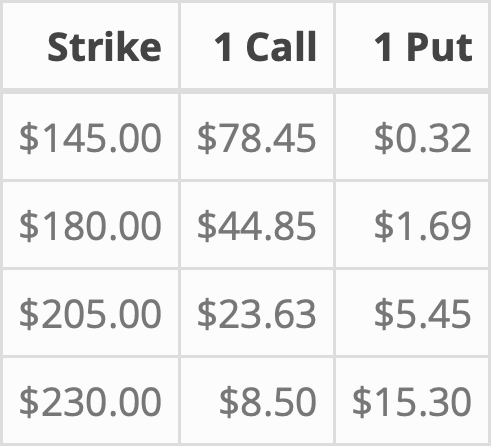
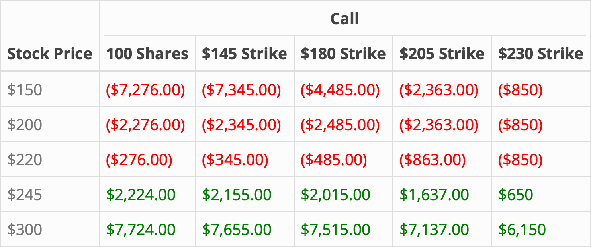

<!-- Each chapter is set to compile separately - include "global" set-up -->

```{r setup, include=FALSE}
knitr::opts_chunk$set(echo = FALSE)

CRAN_repo = getOption("repos")
CRAN_repo["CRAN"] = "http://cran.us.r-project.org"
options(repos = CRAN_repo)

if ( !require("here") )          { install.packages("here") };            require(here)
if ( !require("tidyverse") )     { install.packages("tidyverse") };       require(tidyverse)
if ( !require("ggtext") )        { install.packages("ggtext") };          require(ggtext)
if ( !require("pBrackets") )     { install.packages("pBrackets") };       require(pBrackets)
if ( !require("htmlwidgets") )   { install.packages("htmlwidgets") };     require(htmlwidgets)
if ( !require("plotly") )        { install.packages("plotly") };          require(plotly)
if ( !require("formattable") )   { install.packages("formattable") };     require(formattable)
if ( !require("kableExtra") )    { install.packages("kableExtra") };      require(kableExtra)

options(kableExtra.html.bsTable = TRUE)
options(kableExtra.auto_format = FALSE)
```

```{r Set-Global-Chapter-Variables}
plot_bg <- "#FFFFFF" # "#191919"
plot_fg <- "#000000" # #929292"
plot_fg_alt <- "#969696" # ??

save_tables_as_pictures <- FALSE
load_table_pictures <- TRUE
out_width_plot <- "80%"
out_width_table <- "90%"

grid::grid.locator(unit="npc") 
output_epub = knitr::opts_knit$get("rmarkdown.pandoc.to") == "epub3"
```

```{r Plotting-Helper-Functions}
### Source: https://stackoverflow.com/questions/35633239/add-curly-braces-to-ggplot2-and-then-use-ggsave
bracketsGrob <- function(...){
l <- list(...)
e <- new.env()
e$l <- l
  grid:::recordGrob(  {
    do.call(grid.brackets, l)
  }, e)
}

options_theme <- function() {
  theme_classic() + 
  theme(plot.title = element_text(hjust = 0.03, face = "plain", size = 13, 
                                  colour = "grey33", lineheight = 1.2,
                                  margin = margin(5, 0, 10, 0)),
        legend.position = "none", 
        text = element_text(size=16), 
        panel.border = element_blank(), 
        panel.grid.major = element_blank(),
        panel.grid.minor = element_blank(), 
        panel.background = element_rect(fill = plot_bg, color = plot_bg),
        plot.background = element_rect(fill = plot_bg, color = plot_bg),
        axis.line = element_line(colour = plot_bg),
        axis.title.x = element_text(margin = unit(c(4, 0, 0, 0), "mm"), 
                                    colour = plot_fg),
        axis.title.y = element_text(margin = unit(c(0, 4, 0, 0), "mm"), 
                                    angle = 90),
        axis.text.x = element_text(colour = "black"), 
        axis.ticks = element_blank() )
}


stock_payoff <- function(data, main) {
  ggplot() + 
  geom_line(data = data, aes(stock_price_x, stock_profit_y, color = Profitable), linetype = "solid") +   
  geom_segment(data = data,
               aes(x = min(stock_price_x)+1, xend = min(stock_price_x), 
                   y = min(stock_profit_y)+1, yend = min(stock_profit_y)), 
               arrow = arrow(length = unit(0.50, "cm"), type = "open", angle = 30), 
               show.legend = FALSE, col = "red") + 
  geom_segment(data = data,
               aes(x = max(stock_price_x)-1, xend = max(stock_price_x), 
                   y = max(stock_profit_y)-1, yend = max(stock_profit_y)), 
               arrow = arrow(length = unit(0.50, "cm"), angle = 30, type = "open"), 
               show.legend = FALSE, col = "green3") + 
  scale_y_continuous(label = scales::dollar) +
  scale_x_continuous(label = scales::dollar) + 
  labs(title = main, x = "", y = "") +
  scale_color_manual(values = c("Profit" = "green3", "Loss" = "red"),
                     labels = c("", "", ""), guide = "legend") + 
  guides(color = guide_legend(override.aes = list(color = c("white", "white","white"),
                                                  linetype = c("dashed","solid","solid")))) + 
  options_theme()
}


call_payoff <- function(data, main) {
  ggplot() + 
  geom_line(data = data, aes(Call_x, Call_y, color = Profitable),
            linetype = "solid") +   
  geom_segment(data = data,
               aes(x = min(Call_x), xend = min(Call_x), y = min(Call_y), yend = min(Call_y)), 
               arrow = arrow(length = unit(0.50, "cm"), type = "open"), 
               show.legend = FALSE, col = "red") + 
  geom_segment(data = data,
               aes(x = max(Call_x)-1, xend = max(Call_x), y = max(Call_y)-1, yend = max(Call_y)), 
               arrow = arrow(length = unit(0.50, "cm"), angle = 30, type = "open"), 
               show.legend = FALSE, col = "green3") + 
  scale_y_continuous(label = scales::dollar) +
  scale_x_continuous(label = scales::dollar) + 
  labs(title = main, x = "", y = "") +
  scale_color_manual(values = c("Profit" = "green3", "Loss" = "red"),
                     labels = c("", ""), guide = "legend") + 
  guides(color = guide_legend(override.aes = list(color = c("white","white"),
                                                  linetype = c("solid","solid")))) + 
  options_theme()
}


stock_and_call_payoff <- function(data_stock, data_call, main) { 
  ggplot() + 
  geom_line(data = data_stock, aes(stock_price_x, stock_profit_y, color = Profitable), 
            linetype = "dotdash") +   
  geom_segment(data = data_stock, linetype = "dotdash",
               aes(x = min(stock_price_x)+1, xend = min(stock_price_x), 
                   y = min(stock_profit_y)+1, yend = min(stock_profit_y)), 
               arrow = arrow(length = unit(0.50, "cm"), type = "open", angle = 30), 
               show.legend = FALSE, col = adjustcolor("red", alpha.f = 0.5)) + 
  geom_segment(data = data_stock, linetype = "dotdash",
               aes(x = max(stock_price_x)-1, xend = max(stock_price_x), 
                   y = max(stock_profit_y)-1, yend = max(stock_profit_y)), 
               arrow = arrow(length = unit(0.50, "cm"), angle = 30, type = "open"), 
               show.legend = FALSE, col = adjustcolor("green3", alpha.f = 0.5)) + 
  geom_line(data = data_call, aes(Call_x, Call_y, color = Profitable), linetype = "solid") +   
  geom_segment(data = data_call,
               aes(x = min(Call_x), xend = min(Call_x), y = min(Call_y), yend = min(Call_y)), 
               arrow = arrow(length = unit(0.50, "cm"), type = "open"), 
               show.legend = FALSE, col = "red") + 
  geom_segment(data = data_call,
               aes(x = max(Call_x)-1, xend = max(Call_x), y = max(Call_y)-1, yend = max(Call_y)), 
               arrow = arrow(length = unit(0.50, "cm"), angle = 30, type = "open"), 
               show.legend = FALSE, col = "green3") + 
  labs(title = main, x = "", y = "") +
  scale_y_continuous(label = scales::dollar) +
  scale_x_continuous(label = scales::dollar) + 
  scale_color_manual(values = c( "Profit_call" = "green3", "Loss_call" = "red",
                             "Profit_stock" = adjustcolor("green3", alpha.f = 0.5),
                             "Loss_stock" = adjustcolor("red", alpha.f = 0.5)),
                 labels = c("", "", "", "", ""), guide = "legend") + 
  guides(color = guide_legend(override.aes = list(color = c("white","white"),
                                                  linetype = c("solid","solid")))) + 
  options_theme()
}


put_payoff <- function(data, main) {
  ggplot() + 
  geom_line(data = data, aes(Put_x, Put_y, color = Profitable), linetype = "solid") +
  geom_segment(data = data,
               aes(x = min(Put_x), xend = min(Put_x)-1, y = max(Put_y), yend = max(Put_y)+1), 
               arrow = arrow(length = unit(0.50, "cm"), type = "open"), 
               show.legend = FALSE, col = "green3") + 
  geom_segment(data = data,
               aes(x = max(Put_x), xend = max(Put_x), y = min(Put_y), yend = min(Put_y)), 
               arrow = arrow(length = unit(0.50, "cm"), angle = 210, type = "open"), 
               show.legend = FALSE, col = "red") + 
  scale_y_continuous(label = scales::dollar) +
  scale_x_continuous(label = scales::dollar) + 
  labs(title = main, x = "", y = "") +
  scale_color_manual(values = c( "Profit" = "green3", "Loss" = "red"),
                 labels = c("", ""), guide = "legend") + 
  options_theme()
}


stock_and_put_payoff <- function(data_stock, data_put, main) { 
  ggplot() + 
  geom_line(data = data_stock, aes(stock_price_x, stock_profit_y, color = Profitable), 
            linetype = "dotdash") +   
  geom_segment(data = data_stock, linetype = "dotdash",
               aes(x = min(stock_price_x)+1, xend = min(stock_price_x), 
                   y = min(stock_profit_y)+1, yend = min(stock_profit_y)), 
               arrow = arrow(length = unit(0.50, "cm"), type = "open", angle = 30), 
               show.legend = FALSE, col = adjustcolor("red", alpha.f = 0.5)) + 
  geom_segment(data = data_stock, linetype = "dotdash",
               aes(x = max(stock_price_x)-1, xend = max(stock_price_x), 
                   y = max(stock_profit_y)-1, yend = max(stock_profit_y)), 
               arrow = arrow(length = unit(0.50, "cm"), angle = 30, type = "open"), 
               show.legend = FALSE, col = adjustcolor("green3", alpha.f = 0.5)) + 
  geom_line(data = data_put, aes(Put_x, Put_y, color = Profitable), linetype = "solid") +
  geom_segment(data = data_put,
               aes(x = min(Put_x), xend = min(Put_x)-1, y = max(Put_y), yend = max(Put_y)+1), 
               arrow = arrow(length = unit(0.50, "cm"), type = "open"), 
               show.legend = FALSE, col = "green3") + 
  geom_segment(data = data_put,
               aes(x = max(Put_x), xend = max(Put_x), y = min(Put_y), yend = min(Put_y)), 
               arrow = arrow(length = unit(0.50, "cm"), angle = 210, type = "open"), 
               show.legend = FALSE, col = "red") + 
  labs(title = main, x = "", y = "") +
  scale_y_continuous(label = scales::dollar) +
  scale_x_continuous(label = scales::dollar) + 
  scale_color_manual(values = c( "Profit_put" = "green3", "Loss_put" = "red",
                             "Profit_stock" = adjustcolor("green3", alpha.f = 0.5),
                             "Loss_stock" = adjustcolor("red", alpha.f = 0.5)),
                 labels = c("", "", "", "", ""), guide = "legend") + 
  guides(color = guide_legend(override.aes = list(color = c("white","white"),
                                                  linetype = c("solid","solid")))) + 
  options_theme()
}
```

```{r Table-Helper-Functions}
at_least_number <- function(x,number) {
  ifelse( typeof(x) == "character", 
          return( as.numeric(gsub('\\(','-',gsub('[)$,]', '', x))) >= number ),
          return( x >= number) )
}

remove_negative_zeros <- function(x) { (x[which(-1e-4 < x & x < 1e-4)] = 0); return(x) }
```

# Thinking in Payoff Diagrams {#Payoff-Diagrams}
We'll start our journey into understanding options by building our first tool - the payoff diagram. A payoff diagram show how much money an option makes as we change the price of the stock's shares. They are the best way to visualize how an option (or options strategy) might perform, so our goal in this chapter is to get comfortable with using them.

Our second goal is to understand how options perform compared to owning shares. To help us do that, we'll be using tables that compare the absolute and relative performance of those positions. Tables let us quickly compare the actual performance of different positions, which is exactly what we need for this. 

In our first few chapters, we'll be looking at how options perform on their expiry date. Later on, we'll look at options are priced before their expiry date, the option greeks, how to risk-manage an options position, and how to build investment portfolios using options. But before we get there, we need to know when and why to use different options strategies. The payoff diagram and these tables give us the tools we need to figure that out.


## Payoff Diagrams for Stocks

```{r Stock-Demo, fig.align = "center"}
Stock_cost <- 200
x_min = 160; x_max = 240

Stock_Payoff_XYZ <- tibble( "stock_price_x" = seq(from = x_min, to = x_max, by = 0.01),
                            "stock_profit_y" = -Stock_cost + seq(from = x_min, to = x_max, by = 0.01),
                            "Profitable" = ifelse(-Stock_cost + seq(from = x_min, to = x_max, by = 0.01) > 0, 
                                                  "Profit","Loss") )

s1 <- bracketsGrob(0.25, 0.25, 0.25, 0.5, lwd=2, col="red")
s2 <- bracketsGrob(0.75, 0.75, 0.75, 0.5, lwd=2, col="green3")

### Source: https://stackoverflow.com/questions/35633239/add-curly-braces-to-ggplot2-and-then-use-ggsave
temp <- stock_payoff(Stock_Payoff_XYZ, main = "Buy XYZ's shares at $200.")
y_axis_labels <- na.omit( ggplot_build(temp)$layout$panel_params[[1]]$y$get_labels() )
y_axis_labels <- as.numeric(gsub('\\(','-',gsub('[)$,]', '', y_axis_labels)))
tick_color <- ifelse( y_axis_labels < 0, "red", "green3" )

temp <- temp + theme( axis.text.y = element_markdown(colour = tick_color) ) + 
     annotate( geom = "text", x = 160, y = -12, color = "red", hjust = 0, 
               label = paste0("Losses"), size = 5 ) + 
     annotate( geom = "text", x = 231, y = 12, color = "green3", hjust = 0, 
               label = paste0("Profits"), size = 5 ) + 
     annotate( geom = "text", x = Stock_cost-7.5, y = min(y_axis_labels), color = "green3", hjust = 0,
               label = paste0("Breakeven: ", scales::dollar(Stock_cost)), size = 4 ) + 
     annotate( geom = "text", x = Stock_cost-7.5, y = min(y_axis_labels), color = "red", hjust = 0,
               label = "Breakev", size = 4 ) +
     annotation_custom( s1 ) + annotation_custom( s2 ) 

if ( !output_epub ) { print(temp); rm(temp) }
if ( output_epub ) { knitr::include_graphics("02-payoff-diagrams_files/figure-html/Stock-Demo-1.png") }
```

## Options on Expiry Day
```{r Call-Demo}
Call_cost <- 15; Put_cost <- 5
Call_K <- 200; Put_K <- 180
Current_price <- 200
Future_price <- 240
```
For the most part, we can buy and sell options, just like we can stocks. There are a few key differences, though. The first is that every option has an expiry date, and after they expire they are worthless. They're literally worth `r currency(0)` after they expire, and they can't be traded after that happens. The second is that not every stock has options available, and it can take longer to buy or sell after we put an order in. For big companies, this is not really an issue - companies like Apple and Microsoft should always have options available and they should trade very quickly. But if we wanted to trade options of smaller companies, we should keep these potential limitations in mind. 

Our first look at options will be with a fictious company, Company XYZ. Company XYZ is trading at `r currency(Current_price)`. Suppose that we see the following two options available for purchase. 

1. A `r currency(Call_K)` strike call that expires in 60 days and costs `r currency(Call_cost)`.
2. A `r currency(Put_K)` strike put that expires in 60 days and costs `r currency(Put_cost)`. 

This call option empowers its buyer to purchase shares of Company XYZ for `r currency(Call_K)` any time the markets are open in the next 60 days. This put empowers its buyer to sell shares of Company XYZ for `r currency(Put_K)` any time the markets are open in the next 60 days. After the 60th day, the option will expire and become worthless (worth `r currency(0)`). 

## Call Options
Here's the payoff diagram for this call on XYZ. 

```{r Call-Option-Payoff-Plot, out.width = out_width_plot, fig.align = "center", message = FALSE}
Call_cost <- 15; Call_K <- 200
x_min <- 140; x_max = 280

Call_Payoff_XYZ_200 <- tibble( "Call_x" = seq(from = x_min, to = x_max, by = 0.01),
                               "Call_y" = -Call_cost + (Call_x > Call_K)*(Call_x-Call_K),
                               "Profitable" = ifelse(-Call_cost + (Call_x > Call_K)*(Call_x-Call_K) > 0, 
                                                      "Profit","Loss") )

c1 <- bracketsGrob(0.25, 0.10, 0.25, 0.255, lwd=2, col="red")
c2 <- bracketsGrob(0.80, 0.69, 0.80, 0.255, lwd=2, col="green3")

temp <- call_payoff(data = Call_Payoff_XYZ_200, main = "Buy 1 XYZ call at the $200 Strike.")
y_axis_labels <- na.omit( ggplot_build(temp)$layout$panel_params[[1]]$y$get_labels() )
y_axis_labels <- as.numeric(gsub('\\(','-',gsub('[)$,]', '', y_axis_labels)))
tick_color <- ifelse( as.numeric(gsub('\\(','-',gsub('[)$,]', '', y_axis_labels))) < 0,
                      "red", "green3" )

temp <- temp + theme( axis.text.y = element_markdown(colour = tick_color) ) + 
     annotate( geom = "text", x = 145, y = -7, color = "red", hjust = 0, 
               label = paste0("Losses"), size = 5 ) + 
     annotate( geom = "text", x = 270, y = 20.5, color = "green3", hjust = 0, 
               label = paste0("Profits"), size = 5 ) + 
     annotate( geom = "text", x = Call_K+Call_cost-14, y = min(y_axis_labels)-20, color = "green3", hjust = 0,
               label = paste0("Breakeven: ", scales::dollar(Call_K+Call_cost)), size = 4 ) + 
     annotate( geom = "text", x = Call_K+Call_cost-14, y = min(y_axis_labels)-20, color = "red", hjust = 0,
               label = "Breakev", size = 4 ) +
     annotation_custom( c1 ) + annotation_custom( c2 ) 

if ( !output_epub ) { print(temp); rm(temp) }
if ( output_epub ) { knitr::include_graphics("02-payoff-diagrams_files/figure-html/Call-Option-Payoff-Plot-1.png") }

# ggplotly(call_payoff(data = Call_Payoff_XYZ_230, Call_K = Call_K, Call_cost = Call_cost,
#                      main = "Buy: Company XYZ's $230 Strike Call")) %>%
#  style(hovertemplate = paste('<b>Share Price</b>: $%{x:.2f}',
#                              '<br><b>Profit Per Share</b>: $%{y:.2f}'))
```
Reading this payoff diagram is not too bad - suppose the shares are worth `r currency(Future_price)` at expiry. If we own the call, it gives us the power to purchase 100 shares for `r currency(Call_K)` each (on the expiry date) and immediately sell them for `r currency(Future_price)`, for a gain of `r currency(Future_price)` - `r currency(Call_K)` = `r currency(Future_price-Call_K)` per share. The call cost `r currency(Call_cost)`, so we end up making `r currency(Future_price-Call_K)` - `r currency(Call_cost)` = `r currency(Future_price-Call_K-Call_cost)` per share. Looking at the payoff diagram, the per-share profit when the stock is at `r currency(Future_price)` is indeed `r currency(Future_price-Call_K-Call_cost)`. 

There are a couple more things to make note of. The first is that even though the call lets us purchase shares for `r currency(Call_K)`, we don't start making money until they reach `r currency(Call_K+Call_cost)` because we have to make back the `r currency(Call_cost)` we spent buying the option. `r currency(Call_K+Call_cost)` is such an important value that it has its own name - it's the breakeven price. The second is that the most we can lose is the `r currency(Call_cost)` we spent buying the call. If the shares are `r currency(Call_K-30)`, `r currency(Call_K-50)`, or even `r currency(Call_K-Call_K)`, we can just let the call expire and we'll never lose more than the `r currency(Call_cost)` we spent buying the call. This places a hard limit on the amount of money we can lose, regardless of what happens to Apple's shares. This gives us *limited downside*, an idea we'll come back to again and again. The third is that even with limited downside, we still gets dollar for dollar participation in the upside of the stock on the expiry date of the call (after recovering the `r currency(Call_cost)` it cost to buy). 

This combination of limited downside and full participation to the upside is what make options such a powerful investing tool. But we don't get this power for free. Options put our investments on the clock - prices must move in our favor before the option expires or we lose money. For us to succesfully trade options, we'll want to develop strategies that to help manage the risk of running out of time. We'll discuss the later on, but for now we want to focus on three big ideas: having limited downside, having full participation to the upside, and being time-limited.

Let's go through the decisions that we can make at different prices of Company XYZ's stock. If the stock is below the strike price of `r currency(Call_K)` on the call's expiry date, we will not exercise it. If we did, we would be buying the shares for more than they are worth on the market, and we wouldn't make any profit by selling them. If the stock is above `r currency(Call_K)` on expiry, we will exercise the call. We would be buying shares for less than they are worth on the market, and can immediately sell them at the market price. However, we only make profits after recovering the `r currency(Call_cost)` cost of the call. If the shares are between `r currency(Call_K)` and `r currency(Call_K+Call_cost)`, we will recover some of the cost of the call, but will still lose money. If the shares are above `r currency(Call_K+Call_cost)`, we will profit from the call. 

```{r Stock-vs-Call-Payoff-Plot, out.width = out_width_plot, fig.align = "center", message = FALSE}
Stock_cost <- 200
Call_cost <- 15; Call_K <- 200
x_min <- 140; x_max = 280

Stock_Payoff_XYZ <- tibble( "stock_price_x" = seq(from = x_min, to = x_max, by = 0.01),
                            "stock_profit_y" = -Stock_cost + seq(from = x_min, to = x_max, by = 0.01),
                            "Profitable" = ifelse(-Stock_cost + seq(from = x_min, to = x_max, by = 0.01) > 0, 
                                                  "Profit_stock","Loss_stock") )

Call_Payoff_XYZ_200 <- tibble( "Call_x" = seq(from = x_min, to = x_max, by = 0.01),
                               "Call_y" = -Call_cost + (Call_x > Call_K)*(Call_x-Call_K),
                               "Profitable" = ifelse(-Call_cost + (Call_x > Call_K)*(Call_x-Call_K) > 0, 
                                                      "Profit_call","Loss_call") )

s1 <- bracketsGrob(0.20, 0.20, 0.20, 0.46, lwd=1, lty = "dotdash", 
                   col=adjustcolor("red", alpha.f = 0.5))
s2 <- bracketsGrob(0.85, 0.85, 0.85, 0.44, lwd=1, lty = "dotdash",
                   col=adjustcolor("green3", alpha.f = 0.5))
  
c1 <- bracketsGrob(0.25, 0.34, 0.25, 0.45, lwd=2, col="red", lty = "solid")
c2 <- bracketsGrob(0.80, 0.70, 0.80, 0.45, lwd=2, col="green3", lty = "solid")


temp <- stock_and_call_payoff( data_stock = Stock_Payoff_XYZ, data_call = Call_Payoff_XYZ_200, 
                               main = "Buying 1 XYZ call at the $200 Strike (solid line) vs. \nbuying XYZ shares at $200 (dashed line)." ) 
y_axis_labels <- na.omit( ggplot_build(temp)$layout$panel_params[[1]]$y$get_labels() )
y_axis_labels <- as.numeric(gsub('\\(','-',gsub('[)$,]', '', y_axis_labels)))
tick_color <- ifelse( as.numeric(gsub('\\(','-',gsub('[)$,]', '', y_axis_labels))) < 0,
                      "red", "green3" )

temp <- temp + theme( axis.text.y = element_markdown(colour = tick_color) ) + 
     annotate( geom = "text", x = 140, y = -5, color = "red", hjust = 0, 
               label = paste0("Losses"), size = 5 ) + 
     annotate( geom = "text", x = 270, y = 20, color = "green3", hjust = 0, 
               label = paste0("Profits"), size = 5 ) + 
     annotation_custom( c1 ) + annotation_custom( c2 ) + 
     annotation_custom( s1 ) + annotation_custom( s2 ) 

if ( !output_epub ) { print(temp); rm(temp) }
if ( output_epub ) { knitr::include_graphics("02-payoff-diagrams_files/figure-html/Stock-vs-Call-Payoff-Plot-1.png") }
```

The payoff diagram summarizes all of this information, and helps us see the price levels that go along with these decisions very quickly. Drawing payoff diagrams is one of the easiest and most effective ways to understand the potential profit or loss of an option.

## Put Options
```{r Put-Demo}
Call_cost <- 10; Put_cost <- 10
Call_K <- 230; Put_K <- 180
Future_price <- 150
```

Puts are a little strange if you haven't seen them before. Instead of giving us the option to buy shares at a specific price, they give us the option to sell shares at a specific price. This is the opposite of how we're used to thinkng, so don't worry if it doesn't click right away. 

We're looking at a put with a `r currency(Put_K)` strike that costs `r currency(Put_cost)`. This put gives us the option to sell shares of Company XYZ for `r currency(Put_K)`, and we'll make money if the stock is below `r currency(Put_K)`. If the shares are trading at `r currency(Future_price)`, then we can purchase 100 shares for `r currency(Future_price)` (each) and sell them for `r currency(Put_K)` (each), for an instant gain of `r currency(Put_K-Future_price)` per share. Remembering that the put cost us `r currency(Put_cost)`, we'll be left with a profit of `r currency(Put_K-Future_price-Put_cost)`. Looking at the payoff diagram, buyers of this put do indeed profit by `r currency(Put_K-Future_price-Put_cost)` per share when the shares are at `r currency(Future_price)`. 


```{r Put-Option-Payoff-Plot, out.width = out_width_plot, fig.align = "center", message = FALSE}
Put_cost <- 10; Put_K <- 180
x_min <- 100; x_max = 240

Put_Payoff_XYZ_180 <- tibble( "Put_x" = seq(from = x_min, to = x_max, by = 0.01),
                              "Put_y" = -Put_cost - (Put_x < Put_K) * (Put_x - Put_K),
                              "Profitable" = ifelse(-Put_cost - (Put_x < Put_K) * (Put_x - Put_K) > 0,
                                                    "Profit", "Loss") )

p1 <- bracketsGrob(0.625, 0.225, 0.625, 0.125, lwd=2, col="red", lty = "solid")
p2 <- bracketsGrob(0.25, 0.225, 0.25, 0.625, lwd=2, col="green3", lty = "solid")

temp <- put_payoff(data = Put_Payoff_XYZ_180, main = "Buy 1 XYZ $180 strike put.")
y_axis_labels <- na.omit( ggplot_build(temp)$layout$panel_params[[1]]$y$get_labels() )
y_axis_labels <- as.numeric(gsub('\\(','-',gsub('[)$,]', '', y_axis_labels)))
tick_color <- ifelse( as.numeric(gsub('\\(','-',gsub('[)$,]', '', y_axis_labels))) < 0,
                      "red", "green3" )

temp <- temp + theme( axis.text.y = element_markdown(colour = tick_color) ) + 
     annotate( geom = "text", x = 200, y = -4.5, color = "red", hjust = 0, 
               label = paste0("Losses"), size = 5 ) + 
     annotate( geom = "text", x = 105, y = 20, color = "green3", hjust = 0, 
               label = paste0("Profits"), size = 5 ) + 
     annotate( geom = "text", x = Put_K-Put_cost-15, y = min(y_axis_labels)-17.5, color = "red", 
             hjust = 0, label = paste0("Breakeven: ", scales::dollar(Put_K-Put_cost)), size = 4 ) + 
     annotate( geom = "text", x = Put_K-Put_cost-15, y = min(y_axis_labels)-17.5, color = "green3", 
               hjust = 0, label = "Breakev", size = 4 ) +
     annotation_custom( p1 ) + annotation_custom( p2 ) 

if ( !output_epub ) { print(temp); rm(temp) }
if ( output_epub ) { knitr::include_graphics("02-payoff-diagrams_files/figure-html/Put-Option-Payoff-Plot-1.png") }
```     

The breakeven of the put is `r currency(Put_K-Put_cost)`, because we need the shares to fall by `r currency(Put_cost)` to recover the cost of buying the put. Similar to calls, we can't lose more than we paid for the put. Unlike calls, the dollar-for-dollar "upside" participation we get happens when the stock goes down. This is the big idea behind puts - they make money when prices go down. This is a magical property because it opens up so many new investing strategies. Some are simple and some are very complex. But they're all built the same way - by mixing and matching different combinations of puts, calls, and shares to control how much an investment portfolio goes up (or down) when market prices go up. We'll come back to this idea every time we use options to construct risk-managed investments, which we'll do many times in this book.


```{r Stock-vs-Put-Payoff-Plot, out.width = out_width_plot, fig.align = "center", message = FALSE}
Put_cost <- 10; Put_K <- 180
x_min <- 100; x_max = 260
Stock_cost <- 200

Stock_Payoff_XYZ <- tibble( "stock_price_x" = seq(from = x_min, to = x_max, by = 0.01),
                            "stock_profit_y" = -Stock_cost + seq(from = x_min, to = x_max, by = 0.01),
                            "Profitable" = ifelse(-Stock_cost + seq(from = x_min, to = x_max, by = 0.01) > 0, 
                                                  "Profit_stock","Loss_stock") )

Put_Payoff_XYZ_180 <- tibble( "Put_x" = seq(from = x_min, to = x_max, by = 0.01),
                              "Put_y" = -Put_cost - (Put_x < Put_K) * (Put_x - Put_K),
                              "Profitable" = ifelse(-Put_cost - (Put_x < Put_K) * (Put_x - Put_K) > 0,
                                                    "Profit_put", "Loss_put") )

s1 <- bracketsGrob(0.20, 0.18, 0.20, 0.81, lwd=1, lty = "dotdash", 
                   col=adjustcolor("red", alpha.f = 0.5))
s2 <- bracketsGrob(0.80, 0.75, 0.80, 0.59, lwd=1, lty = "dotdash",
                   col=adjustcolor("green3", alpha.f = 0.5))
  
p1 <- bracketsGrob(0.25, 0.58, 0.25, 0.75, lwd=2, col="green3", lty = "solid")
p2 <- bracketsGrob(0.50, 0.58, 0.50, 0.525, lwd=2, col="red", lty = "solid")

temp <- stock_and_put_payoff( data_stock = Stock_Payoff_XYZ, data_put = Put_Payoff_XYZ_180, 
                              main = "Buying 1 XYZ put at the $180 strike (solid line) vs. \nbuying XYZ's shares at $200 (dashed line)." ) 
y_axis_labels <- na.omit( ggplot_build(temp)$layout$panel_params[[1]]$y$get_labels() )
y_axis_labels <- as.numeric(gsub('\\(','-',gsub('[)$,]', '', y_axis_labels)))
tick_color <- ifelse( as.numeric(gsub('\\(','-',gsub('[)$,]', '', y_axis_labels))) < 0,
                      "red", "green3" )

temp <- temp + theme( axis.text.y = element_markdown(colour = tick_color) ) + 
     annotate( geom = "text", x = 105, y = 17, color = "green3", hjust = 0, 
               label = paste0("Profits"), size = 5 ) + 
     annotate( geom = "text", x = 210, y = -1, color = "red", hjust = 0, 
               label = paste0("Losses"), size = 5 ) + 
     annotation_custom( p1 ) + annotation_custom( p2 ) + 
     annotation_custom( s1 ) + annotation_custom( s2 ) 

if ( !output_epub ) { print(temp); rm(temp) }
if ( output_epub ) { knitr::include_graphics("02-payoff-diagrams_files/figure-html/Stock-vs-Put-Payoff-Plot-1.png") }
```

## Apple: Calls and Puts

Let’s look at options on Apple stock around 11:00am on August 28, 2019. Apple has options listed for a bunch of different dates: September 20, 2019, October 18, 2019, November 15, 2019, December 20, 2019, January 17, 2020 and so on. These are the expiry dates - the last day a buyer can exercise their right to buy/sell a stock at the strike price before the option becomes worthless. Options on stocks are almost always for 100 shares - calls let their buyer purchase 100 shares at the strike and puts let their buyer sell 100 shares at the strike - even though the price we'll see when we go to buy is their cost per share. For example, a call listed for `r currency(5)` will cost `r 100*currency(5)` because it lets us buy 100 shares at `r currency(5)` each. We call 100 the *multiplier*, because we have to call it something.

```{r Apple-205-Option-Price}
Current_price <- 205.44
Call_K <- 205
Put_K <- 205
Call_cost <- 6.84
Put_cost <- 6.10
```

Moving on to the example, Apple is trading at `r currency(Current_price)`. The September 20, 2019 call with a `r currency(Call_K)` strike us buy 100 shares of Apple for `r currency(Call_K)` (each) on September 20, 2019. It is trading for `r currency(100*Call_cost)` - the buyer is paying <span class = "fraction" data-top="`r currency(100*Call_cost)`" data-bottom="100"></span> = `r currency(Call_cost)` per share for this call. The September 20, 2019 put lets its buyer sell 100 shares of Apple for `r currency(Current_price)` each on September 20, 2019. It is trading for `r currency(100*Put_cost)` - the buyer is paying <span class = "fraction" data-top="`r currency(100*Put_cost)`" data-bottom="100"></span> = `r currency(Put_cost)` per share. 

```{r Apple-Call-Payoff-Plot, out.width = out_width_plot, fig.align = "center", message = FALSE}
Call_cost <- 6.84; Call_K <- 205
Current_price <- 205.44
x_min = 185; x_max = 235

Call_Payoff_Apple_205 <- tibble( "Call_x" = seq(from = x_min, to = x_max, by = 0.01),
                                 "Call_y" = -Call_cost + (Call_x > Call_K)*(Call_x-Call_K),
                                 "Profitable" = ifelse(-Call_cost + (Call_x > Call_K)*(Call_x-Call_K) > 0, 
                                                       "Profit","Loss") )

c1 <- bracketsGrob(0.30, 0.085, 0.30, 0.265, lwd=2, col="red")
c2 <- bracketsGrob(0.80, 0.69, 0.80, 0.28, lwd=2, col="green3")

temp <- call_payoff(data = Call_Payoff_Apple_205, main = "Buy 1 Apple $205 strike call.")
y_axis_labels <- na.omit( ggplot_build(temp)$layout$panel_params[[1]]$y$get_labels() )
y_axis_labels <- as.numeric(gsub('\\(','-',gsub('[)$,]', '', y_axis_labels)))
tick_color <- ifelse( as.numeric(gsub('\\(','-',gsub('[)$,]', '', y_axis_labels))) < 0,
                      "red", "green3" )

temp <- temp + theme( axis.text.y = element_markdown(colour = tick_color) ) + 
     annotate( geom = "text", x = 190, y = -3.5, color = "red", hjust = 0, 
               label = paste0("Losses"), size = 5 ) + 
     annotate( geom = "text", x = 230, y = 6.8, color = "green3", hjust = 0, 
               label = paste0("Profits"), size = 5 ) + 
     annotate( geom = "text", x = Call_K+Call_cost-5, y = min(y_axis_labels)-8, color = "green3", 
               hjust = 0, label = paste0("Breakeven: ", scales::dollar(Call_K+Call_cost)), size = 4 ) + 
     annotate( geom = "text", x = Call_K+Call_cost-5, y = min(y_axis_labels)-8, color = "red", 
               hjust = 0, label = "Breakev", size = 4 ) +
     annotation_custom( c1 ) + annotation_custom( c2 ) 

if ( !output_epub ) { print(temp); rm(temp) }
if ( output_epub ) { knitr::include_graphics("02-payoff-diagrams_files/figure-html/Apple-Call-Payoff-Plot-1.png") }
```

Here's a payoff diagram of this call option. Below `r currency(Call_K)`, the buyer loses `r currency(Call_cost)` per share, which is what he paid for the call. This is the entire cost of the call, since it expires worthless. Since he paid `r currency(Call_cost)` per share for the call, he has to make `r currency(Call_cost)` back before he becomes profitable. Therefore, his breakeven is `r currency(Call_K)` + `r currency(Call_cost)` = `r currency(Call_cost+Call_K)`. This is reflected in the payoff diagram, where his profits are negative when the stock is below `r currency(Call_cost+Call_K)` and positive when it is above `r currency(Call_cost+Call_K)`.

This next table compares how much money a buyer can make with 100 shares of Apple at `r currency(Current_price)` and 1 call on Apple shares at `r currency(Call_cost)` (with a strike price of `r currency(Call_K)` that expires on September 20, 2019). The relative return column tell us how much the call owner participates in the upside (or downside) experienced by the shareholder. This last column is the most important - it will help us understand how to size our option investments. To give the dollar amounts some context, 100 shares of Apple at `r currency(Current_price)` will cost `r currency(Current_price)` x 100 = `r currency(100*Current_price)` to buy, and one call that gives the buyer the option to buy 100 shares of Apple at `r currency(Call_K)` on September 20, 2019 will cost `r currency(Call_cost)` x 100 = `r currency(100*Call_cost)`.

```{r Apple-Call-Table}
Apple_Current_Price <- 205.44
Apple_Call_K <- 205
Apple_Call_Cost <- 6.84
Apple_Stock_Prices <- c( 150, 180, 184.90, 198.90, 
                         211.84, 218.68, 225.98, 240 )

Apple_Shares_Percent_Return <- remove_negative_zeros(
  (Apple_Stock_Prices - Apple_Current_Price) / Apple_Current_Price )
Apple_Shares_Dollar_Return <- remove_negative_zeros( 
  100 * (Apple_Stock_Prices - Apple_Current_Price) )
Apple_Calls_Percent_Return <- remove_negative_zeros( 
  ( pmax( 0, (Apple_Stock_Prices - Apple_Call_K ) ) - Apple_Call_Cost ) / Apple_Call_Cost )
Apple_Calls_Dollar_Return <- remove_negative_zeros(
  100  * ( pmax( 0, (Apple_Stock_Prices - Apple_Call_K ) ) - Apple_Call_Cost ) )
  
Apple_Call_Table <- tibble( "Stock Price" = currency(Apple_Stock_Prices),
                            "Percent Return " = percent(Apple_Shares_Percent_Return),
                            "Dollar Return " = scales::dollar(Apple_Shares_Dollar_Return,
                                                              negative_parens = TRUE), 
                            " Percent Return" = percent(Apple_Calls_Percent_Return),
                            " Dollar Return" =  scales::dollar(Apple_Calls_Dollar_Return,
                                                               negative_parens = TRUE), 
                            "Calls/Shares" = sign(Apple_Calls_Dollar_Return) * 
                               percent( Apple_Calls_Dollar_Return / Apple_Shares_Dollar_Return ) )

Apple_Call_Table <- Apple_Call_Table %>% 
  mutate_if(c(FALSE,rep(TRUE,dim(Apple_Call_Table)[2]-1)), 
              ~cell_spec(.x, color = ifelse( at_least_number(.x,0), "green"," red"))) %>%
  knitr::kable(booktabs = TRUE, escape = FALSE) %>% 
  kable_styling(bootstrap_options = c("bordered", "condensed", "responsive"),
                full_width = FALSE ) %>%
  add_header_above(c("Stock" = 1, "Own 100 Shares" = 2, 
                     "Own 1 Call" = 2, "Relative Return" = 1) ) 

kableExtra:::save_kable(Apple_Call_Table, zoom = 2.5, file="img/02_Apple_Call_Table.png") 
```

<figure style='margin-left:5%;'>
    <font size="3" color = "grey">
    <figcaption> Comparing the returns from owning 100 shares vs. 1 call. </figcaption>
    </font>
    <p>  </p>
</figure>

The buyer can make a ton of money with this call. To double his investment, he only needs to recover the `r currency(Apple_Call_Cost)` it cost to buy the call (done at the breakeven of `r currency(Apple_Call_K)` + `r currency(Apple_Call_Cost)` = `r currency(Apple_Call_K+Apple_Call_Cost)`), and have the shares go up another `r currency(Apple_Call_Cost)` to `r currency(Apple_Call_K+Apple_Call_Cost)` + `r currency(Apple_Call_Cost)` = `r currency(Apple_Call_K+2*Apple_Call_Cost)`. Remember that Apple was trading for `r currency(Apple_Current_Price)` when he bought the call. If he bought shares instead, the buyer would make <span class = "fraction" data-top="`r currency(Apple_Call_K+2*Apple_Call_Cost)` - `r currency(Apple_Current_Price)`" data-bottom = "`r currency(Apple_Current_Price)`"></span> = `r percent(2*Apple_Call_Cost/Apple_Current_Price)` on his investment. By using calls, he makes <span class = "fraction" data-top="`r currency(Apple_Call_K+2*Apple_Call_Cost)` - `r currency(Apple_Call_K)` - `r currency(Apple_Call_Cost)`" data-bottom = "`r currency(Apple_Call_Cost)`"></span> = `r percent(Apple_Call_Cost/Apple_Call_Cost)`. `r percent(Apple_Call_Cost/Apple_Call_Cost)` is so much larger than `r percent(2*Apple_Call_Cost/Apple_Current_Price)` that this seems impossible, but the way to think about this is by looking at how much of the upside in the stock the call buyer participates in. 

Calls also limit the buyer's maximum loss to the cost of the call. The most he can lose is the `r currency(Apple_Call_Cost)` he paid for it. If he bought shares of Apple for `r currency(Apple_Current_Price)`, it would have to fall to `r currency(Apple_Current_Price - Apple_Call_Cost)` (`r currency(Apple_Current_Price)` - `r currency(Apple_Call_Cost)` = `r currency(Apple_Current_Price - Apple_Call_Cost)`) for the buyer to lose the same `r currency(Apple_Call_Cost)` per share. That’s a small <span class = "fraction" data-top="`r currency(Apple_Current_Price)` - `r currency(Apple_Call_Cost)`" data-bottom="`r currency(Apple_Current_Price)`"></span> = 3.33% decline in a bit under 30 days, which could very possibly happen. Now, if Apple falls to `r currency(Apple_Stock_Prices[2])`, the call buyer still only loses `r currency(Apple_Call_Cost)` per share. Someone who had bought shares would lose `r currency(Apple_Current_Price)` - `r currency(Apple_Stock_Prices[2])` = `r currency(Apple_Current_Price - Apple_Stock_Prices[2])` per share, which is almost four times as much. If the shares fall to `r currency(Apple_Stock_Prices[2])`, the shareholder loses almost seven times as much.

The takeaway here is that the call gives dollar-for-dollar participation to the upside if we hold the option to its expiry date. It has two drawbacks - we have to recover the cost of the call, and it puts a clock on our participation. We'll discuss ways to navigate that the time constraint later. Having to pay for the cost of the call means we lose money below the breakeven of `r currency(Apple_Call_K+Apple_Call_Cost)`, while the shareholder only loses money below `r currency(Apple_Current_Price)`. This is because the shares have to go up by enough to offset the cost of the call, or the call buyer can lose money even when the shareholder does not. 

Even with these two drawbacks, a call still limits an investor's downside compared to owning shares and gives good participation to the upside. This is the picture painted by the payoff diagram - the most we can lose is the cost of the call, and we participate dollar for dollar in the upside of the stock (after reclaiming the cost of the call). This payoff profle comes at a cost - the call expires, but the shares do not. If we own shares that are down, we can continue holding them and hope for a rebound at the risk of potentially losing more money. With the call, the most we can lose is its cost but we have to contend with expiry dates. When we start discussing options investing strategies, we'll see how this means we will have to think about which expiry date we want, how to adjust to an earlier or later expiry date if our opinion changes during the trade, and so on. 


```{r Apple-Put-Option-Payoff-Plot, out.width = out_width_plot, fig.align = "center", message = FALSE}
Put_Cost <- 6.10; Put_K <- 205
Apple_Put_Cost <- Put_Cost; Apple_Put_K <- Put_K
x_min = 180; x_max = 230
Put_x <- seq(from = 180, to = 230, by = 1)
Put_y <- -Put_cost - (Put_x < Put_K) * (Put_x - Put_K)
  
Put_Payoff_Apple_205 <- tibble( "Put_x" = seq(from = x_min, to = x_max, by = 0.01),
                                "Put_y" = -Put_cost - (Put_x < Put_K) * (Put_x - Put_K),
                                "Profitable" = ifelse(-Put_cost - (Put_x < Put_K) * (Put_x - Put_K) > 0,
                                                      "Profit", "Loss") )

p1 <- bracketsGrob(0.25, 0.265, 0.25, 0.55, lwd=2, col="green3")
p2 <- bracketsGrob(0.60, 0.265, 0.60, 0.05, lwd=2, col="red")

temp <- put_payoff(data = Put_Payoff_Apple_205, main = "Buy 1 Apple $205 strike put.")
y_axis_labels <- na.omit( ggplot_build(temp)$layout$panel_params[[1]]$y$get_labels() )
y_axis_labels <- as.numeric(gsub('\\(','-',gsub('[)$,]', '', y_axis_labels)))
tick_color <- ifelse( as.numeric(gsub('\\(','-',gsub('[)$,]', '', y_axis_labels))) < 0,
                      "red", "green3" )

temp <- temp + theme( axis.text.y = element_markdown(colour = tick_color) ) + 
     annotate( geom = "text", x = 180, y = 4.5, color = "green3", hjust = 0, 
               label = paste0("Profits"), size = 5 ) + 
     annotate( geom = "text", x = 215, y = -3, color = "red", hjust = 0, 
               label = paste0("Losses"), size = 5 ) + 
     annotation_custom( p1 ) + annotation_custom( p2 ) 

if ( !output_epub ) { print(temp); rm(temp) }
if ( output_epub ) { knitr::include_graphics("02-payoff-diagrams_files/figure-html/Apple-Put-Option-Payoff-Plot-1.png") }
```

This put gives its buyer the option to sell shares of Apple at `r currency(Apple_Put_K)` on September 20, 2019. That means if Apple's shares are below `r currency(Apple_Put_K)` on that day, the put buyer makes money. When the shares are above `r currency(Apple_Put_K)`, the put buyer has lost the entire \$6.10 per share that he spent buying the put. If the shares are below `r currency(Apple_Put_K)`, the buyer must recover the cost of his put (done at `r currency(Apple_Put_K)` - `r currency(Apple_Put_Cost)` = `r currency(Apple_Put_K-Apple_Put_Cost)`). Once Apple's shares are below `r currency(Apple_Put_K-Apple_Put_Cost)`, the put buyer partcipates dollar for dollar in the downside of the stock, which is the upside of the put.

The put has the same, or potentially even better, characteristics as the call. It gives limited downside to the buyer of the put, as their maximum loss is limited to the price they paid for the put. It also provides dollar for dollar participation to the downside of the stock. This corresponds to the upside of the put. We'll use this ability to make money when prices are going down many times when discussing different ways to use options to construct investment portfolios.

```{r Apple-Put-Table}
Apple_Current_Price <- 205.44
Apple_Put_K <- 205
Apple_Put_Cost <- 6.10

Apple_Stock_Prices <- remove_negative_zeros( c( 150, 180, 184.90, 198.90, 211.84, 218.68, 225.98, 240 ) )
Apple_Shares_Percent_Return <- 
  remove_negative_zeros( (Apple_Stock_Prices - Apple_Current_Price) / Apple_Current_Price )
Apple_Shares_Dollar_Return <- remove_negative_zeros( 100 * (Apple_Stock_Prices - Apple_Current_Price) )
Apple_Puts_Percent_Return <- 
  remove_negative_zeros( ( pmax( 0, (Apple_Put_K - Apple_Stock_Prices) ) - Apple_Put_Cost ) / Apple_Put_Cost )
Apple_Puts_Dollar_Return <- 
  remove_negative_zeros( 100 * ( pmax( 0, (Apple_Put_K - Apple_Stock_Prices ) ) - Apple_Put_Cost ) )

Apple_Put_Table <- tibble( "Stock Price" = currency(Apple_Stock_Prices),
                           "Percent Return " = percent(Apple_Shares_Percent_Return),
                           "Dollar Return " = scales::dollar(Apple_Shares_Dollar_Return, 
                                                             negative_parens = TRUE), 
                           " Percent Return" = percent(Apple_Puts_Percent_Return),
                           " Dollar Return" =  scales::dollar(Apple_Puts_Dollar_Return, 
                                                              negative_parens = TRUE), 
                           "Puts/Shares" = sign(Apple_Puts_Dollar_Return) * 
                             percent(remove_negative_zeros ( Apple_Puts_Dollar_Return /
                                                               Apple_Shares_Dollar_Return ) ) )

Apple_Put_Table <- Apple_Put_Table %>% 
  mutate_if(c(FALSE,rep(TRUE,dim(Apple_Put_Table)[2]-1)), 
              ~cell_spec(.x, color = ifelse( at_least_number(.x,0), "green"," red"))) %>%
  knitr::kable(booktabs = TRUE, escape = FALSE) %>% 
  kable_styling(bootstrap_options = c("bordered", "condensed", "responsive"),
                full_width = FALSE ) %>%
  add_header_above(c("Stock" = 1, "Own 100 Shares" = 2, 
                     "Own 1 Put" = 2, "Relative Return" = 1) )

kableExtra:::save_kable(Apple_Put_Table, zoom = 2.5, file = "img/02_Apple_Put_Table.png") 
```

<figure style='margin-left:5%;'>
    <font size="3" color = "grey">
    <figcaption> Comparing the returns from owning 100 shares vs. 1 put. </figcaption>
    </font>
    <p>  </p>
</figure>

For now, let’s look at how owning Apple stock compares to holding the put to expiry. If Apple’s stock increases by 10% (from `r currency(Apple_Current_Price)` to `r currency(1.10*Apple_Current_Price)`), a shareholder will make `r currency(1.10*Apple_Current_Price)` - `r currency(Apple_Current_Price)` = `r currency(1.10*Apple_Current_Price-Apple_Current_Price)` per share. If Apple’s stock declines 10% (from `r currency(Apple_Current_Price)` to `r currency(0.90*Apple_Current_Price)`), a shareholder loses `r currency(0.90*Apple_Current_Price)` - `r currency(Apple_Current_Price)` = `r -currency(0.90*Apple_Current_Price-Apple_Current_Price)` per share. Now, let’s look at the put. It costs `r currency(Apple_Put_Cost)` per share, so if Apple’s shares stay above `r currency(Apple_Put_K)`, the put buyer loses `r currency(Apple_Put_Cost)` per share. If Apple’s stock falls to `r currency(0.90*Apple_Current_Price)`, the put buyer makes `r currency(Apple_Put_K)` - `r currency(0.90*Apple_Current_Price)` - `r currency(Apple_Put_Cost)` = `r currency(Apple_Put_K-0.90*Apple_Current_Price-Apple_Put_Cost)` per share, which is <span class = "fraction" data-top="`r currency(Apple_Put_K-0.90*Apple_Current_Price-Apple_Put_Cost)`" data-bottom="`r currency(Apple_Put_Cost)`"></span> = `r round( (Apple_Put_K-0.90*Apple_Current_Price-Apple_Put_Cost)/Apple_Put_Cost,2 )` times his orginal investment of `r currency(Apple_Put_Cost)` in the puts. This number may seem too big to be true but once again, the way to think about it is through how much participation a put gives it buyer to the downside of a stock (which is the upside of the put). 

The put buyer loses `r currency(100*Apple_Put_Cost)` whenever the shares are above `r currency(Apple_Put_K)` while the shareholder makes between 3.12% to 16.82%. When the shares are below the put buyer's breakeven of `r currency(Apple_Put_K-Apple_Put_Cost)`, the put buyer makes money when the shareholder loses money. When the shares are at `r currency(0.90*Apple_Current_Price)`, the put buyer captures 68.16% of the downside of the stock. When the shares are at `r currency(Apple_Stock_Prices[2])`, the put buyer captures 74.29%; when the shares are `r currency(Apple_Stock_Prices[1])`, the put buyer captures 88.20%. This percentage gradually increases because the put buyer must recover the cost of buying the put before he can begin to earn profits.

Much like the call, the put gives its buyer limited downside and strong upside participation. It also gives its buyer a way to make money when prices are falling, a magical property that we will use again and again when constructing investment portfolios. 


## Apple: Different Strikes 
```{r Apple-Different-Strikes}
Apple_Prices_K <- c(145, 180, 205, 230)
Apple_Call_Costs <- c(78.45, 44.85, 23.63, 8.50)
Apple_Put_Costs <- c(0.32, 1.69, 5.45, 15.30)

Apple_Current_Price <- 222.76
Apple_Future_Prices <- c(150, 200, 220, 245, 300)
```

In the first example, we considered possible profits or losses when holding `r currency(Apple_Call_K)` strike options to their expiry date of September 20, 2019. There is nothing special about `r currency(Apple_Call_K)` or September 20, 2019. Many other strike prices and expiry dates are available. For the next example, we'll choose an expiry date of December 20, 2019 and consider the profit or loss for calls with strike prices of `r currency(Apple_Prices_K[1])`, `r currency(Apple_Prices_K[2])`, `r currency(Apple_Prices_K[3])`, and `r currency(Apple_Prices_K[4])`. On September 11, 2019, one share of Apple was trading at `r currency(Apple_Current_Price)` and its options prices are listed below.

```{r Apple-Different-Strikes-Table}
Apple_Different_Strikes <- tibble( "Strike Prices" = currency(Apple_Prices_K),
                                   "1 Call" = currency(Apple_Call_Costs),
                                   "1 Put" = currency(Apple_Put_Costs) ) 

Apple_Different_Strikes <- Apple_Different_Strikes %>% 
  knitr:::kable(booktabs = TRUE, escape = FALSE) %>% 
  kable_styling( bootstrap_options = c("bordered", "condensed", "responsive"),
                 full_width = FALSE )

kableExtra:::save_kable(Apple_Different_Strikes, zoom = 2.5, 
                        file = "img/02_Apple_Different_Strikes.png") 
```

<figure style='margin-left:30%;'>
    <font size="3" color = "grey">
    <figcaption> Cost on Sept. 11, 2019. </figcaption>
    </font>
    <p>  </p>
</figure>


To keep the discussion simple, we’ll continue to focus on the price of the option on its expiry date. Remember, one call lets its buyer purchase 100 shares of Apple at its strike price, and one put lets its buyer sell 100 shares at its strike price. Let’s compare the dollar return of each call option to owning 100 shares if, on December 20, 2019, Apple's shares:

1. Drop a lot to `r currency(Apple_Future_Prices[1])` .
2. Drop a little to `r currency(Apple_Future_Prices[2])`.
3. Stay roughly the same at `r currency(Apple_Future_Prices[3])`.
4. Increase a little to `r currency(Apple_Future_Prices[4])`.
5. Increase a lot to `r currency(Apple_Future_Prices[5])`.

```{r Apple-Different-Strikes-Call-Payoff-Table}
Apple_Different_Strikes_Call_Payoff <- tibble( "Share Price" = scales::dollar(Apple_Future_Prices),
      "100 Shares" = scales::dollar(100 * (Apple_Future_Prices - Apple_Current_Price),
                                    negative_parens = TRUE), 
      "1 $145 Strike Call" = scales::dollar( 100 * ( 
        pmax( 0, Apple_Future_Prices - Apple_Prices_K[1] ) - Apple_Call_Costs[1] ), 
        negative_parens = TRUE ),
      "1 $180 Strike Call" = scales::dollar( 100 * ( 
        pmax(0, Apple_Future_Prices - Apple_Prices_K[2] ) - Apple_Call_Costs[2] ), 
        negative_parens = TRUE ),
      "1 $205 Strike Call" = scales::dollar( 100 * ( 
        pmax( 0, Apple_Future_Prices - Apple_Prices_K[3] ) - Apple_Call_Costs[3] ), 
        negative_parens = TRUE ),
      "1 $230 Strike Call" = scales::dollar( 100 * ( 
        pmax( 0, Apple_Future_Prices - Apple_Prices_K[4] ) - Apple_Call_Costs[4] ), 
        negative_parens = TRUE ) )

Apple_Different_Strikes_Call_Payoff <- Apple_Different_Strikes_Call_Payoff %>% 
  mutate_if(c(FALSE,rep(TRUE,dim(Apple_Different_Strikes_Call_Payoff)[2]-1)), 
              ~cell_spec(.x, color = ifelse( at_least_number(.x,0), "green"," red"))) %>%
  knitr:::kable(booktabs = TRUE, escape = FALSE) %>% 
  kable_styling(bootstrap_options = c("bordered", "condensed", "responsive"), 
                full_width = FALSE )

kableExtra:::save_kable(Apple_Different_Strikes_Call_Payoff, zoom = 2.5, 
             file = "img/02_Apple_Different_Strikes_Call_Payoff_Table.png")
```

<figure style='margin-left:5%;'>
    <font size="3" color = "grey">
    <figcaption> Dollar return if held to expiry. </figcaption>
    </font>
    <p>  </p>
</figure>


To give these dollar returns some context, buying

1. 100 shares costs `r currency(Apple_Current_Price)` x 100 = `r currency(100 * Apple_Current_Price)`
2. 1 `r currency(Apple_Prices_K[1])` strike call costs `r currency(Apple_Call_Costs[1])` x 100 = `r currency(100 * Apple_Call_Costs[1])`
3. 1 `r currency(Apple_Prices_K[2])` strike call costs `r currency(Apple_Call_Costs[2])` x 100 = `r currency(100 * Apple_Call_Costs[2])`
4. 1 `r currency(Apple_Prices_K[3])` strike call costs `r currency(Apple_Call_Costs[3])` x 100 = `r currency(100 * Apple_Call_Costs[3])`
5. 1 `r currency(Apple_Prices_K[4])` strike call costs `r currency(Apple_Call_Costs[4])` x 100 = `r currency(100 * Apple_Call_Costs[4])`

The first thing to do when trying to make sense of option profit and loss numbers is draw to payoff diagrams. I'm only going to include a diagram for the `r currency(Apple_Prices_K[3])` strike call here, but please take a minute to draw the other payoff diagrams yourself. Trying to read ahead without them is dangerous - it might make turn the next few paragraphs an incomprehensible list of numbers.

The `r currency(Apple_Prices_K[4])` strike call (the right-most column in the table) has the simplest profit and loss numbers. Even without a payoff diagram, just having the breakeven price in mind can help make sense of its column in the table below. The breakeven of this call is `r currency(Apple_Prices_K[4])` + `r currency(Apple_Call_Costs[4])` = `r currency(Apple_Prices_K[4]+Apple_Call_Costs[4])`. It costs `r currency(100*Apple_Call_Costs[4])` and expires worthless if Apple's shares are less than `r currency(Apple_Prices_K[4])` on December 20, 2019. If Apple's shares are at `r currency(Apple_Future_Prices[4])`, the call buyer makes `r currency(Apple_Future_Prices[4])` - `r currency(Apple_Prices_K[4])` - `r currency(Apple_Call_Costs[4])` = `r currency(Apple_Future_Prices[4] - Apple_Prices_K[4] - Apple_Call_Costs[4])` per share, or `r 100 * currency(Apple_Future_Prices[4] - Apple_Prices_K[4] - Apple_Call_Costs[4])` per call. If Apple's shares are at `r currency(Apple_Future_Prices[5])`, the call buyer makes `r currency(Apple_Future_Prices[5])`  - `r currency(Apple_Prices_K[4])` - `r currency(Apple_Call_Costs[4])` = `r currency(Apple_Future_Prices[5] - Apple_Prices_K[4] - Apple_Call_Costs[4])` per share, or `r 100 * currency(Apple_Future_Prices[5] - Apple_Prices_K[4] - Apple_Call_Costs[4])` per call. Those are indeed the profit and loss numbers in the table up above. 

```{r Apple-205-Strike-Call-Payoff-Plot, out.width = out_width_plot, fig.align = "center", message = FALSE}
Call_cost <- Apple_Call_Costs[3]
Call_K <- Apple_Prices_K[3]
x_min <- 180; x_max = 280

Call_Payoff_Apple_205 <- tibble( "Call_x" = seq(from = x_min, to = x_max, by = 0.01),
                                 "Call_y" = -Call_cost + (Call_x > Call_K)*(Call_x-Call_K),
                                 "Profitable" = ifelse(-Call_cost + (Call_x > Call_K)*(Call_x-Call_K) > 0, 
                                                       "Profit","Loss") )

c1 <- bracketsGrob(0.25, 0.10, 0.25, 0.36, lwd=2, col="red")
c2 <- bracketsGrob(0.775, 0.72, 0.775, 0.36, lwd=2, col="green3")

temp <- call_payoff(data = Call_Payoff_Apple_205, main = "Buy 1 Apple $205 strike call.")
y_axis_labels <- na.omit( ggplot_build(temp)$layout$panel_params[[1]]$y$get_labels() )
y_axis_labels <- as.numeric(gsub('\\(','-',gsub('[)$,]', '', y_axis_labels)))
tick_color <- ifelse( as.numeric(gsub('\\(','-',gsub('[)$,]', '', y_axis_labels))) < 0,
                      "red", "green3" )

temp <- temp + theme( axis.text.y = element_markdown(colour = tick_color) ) + 
     annotate( geom = "text", x = 185, y = -11.5, color = "red", hjust = 0, 
               label = paste0("Losses"), size = 5 ) + 
     annotate( geom = "text", x = 270, y = 16, color = "green3", hjust = 0, 
               label = paste0("Profits"), size = 5 ) + 
     annotate( geom = "text", x = Call_K+Call_cost-10, y = min(y_axis_labels)-8, color = "green3", 
               hjust = 0, label = paste0("Breakeven: ", scales::dollar(Call_K+Call_cost)), size = 4 ) + 
     annotate( geom = "text", x = Call_K+Call_cost-10, y = min(y_axis_labels)-8, color = "red", 
               hjust = 0, label = "Breakev", size = 4 ) +
     annotation_custom( c1 ) + annotation_custom( c2 ) 

if ( !output_epub ) { print(temp); rm(temp) }
if ( output_epub ) { knitr::include_graphics("02-payoff-diagrams_files/figure-html/Apple-205-Strike-Call-Payoff-Plot-1.png"
) }
```

The `r currency(Apple_Prices_K[3])` strike call is similar. We've drawn the payoff diagram this time, and it gives the breakeven to be `r currency(Apple_Call_Costs[3] + Apple_Prices_K[3])` When shares are below `r currency(Apple_Prices_K[3])`, the call expires worthless and the buyer loses `r currency(100*Apple_Call_Costs[3])`. The call buyer still loses money when shares are at `r currency(Apple_Future_Prices[3])` because `r currency(Apple_Future_Prices[3])` is below this call's breakeven of `r currency(Apple_Call_Costs[3] + Apple_Prices_K[3])`. The call cost `r currency(Apple_Call_Costs[3] + Apple_Prices_K[3])`, but the buyer will have only made `r currency(Apple_Future_Prices[3])` - `r currency(Apple_Prices_K[3])` = `r currency(Apple_Future_Prices[3] - Apple_Prices_K[3])` per share (`r 100*currency(Apple_Future_Prices[3] - Apple_Prices_K[3])` per call) before paying for the call. This leaves him with a loss of `r 100*currency(Apple_Future_Prices[3] - Apple_Prices_K[3])` - `r currency(Apple_Call_Costs[3])` = `r 100*currency(Apple_Future_Prices[3] - Apple_Prices_K[3] - Apple_Call_Costs[3])` per share.

The `r currency(Apple_Prices_K[2])` strike call expires worthless if the shares are below `r currency(Apple_Prices_K[2])`, loses money when they are below the breakeven of `r currency(Apple_Prices_K[2])` + `r currency(Apple_Call_Costs[2])` = `r currency(Apple_Prices_K[2] + Apple_Call_Costs[2])`, and makes money when the shares are above `r currency(Apple_Prices_K[2] + Apple_Call_Costs[2])`. The `r currency(Apple_Prices_K[1])` strike call expires worthless when shares are below `r currency(Apple_Prices_K[1])`, loses money when the shares are below the breakeven of `r currency(Apple_Prices_K[1])` + `r currency(Apple_Call_Costs[1])` = `r currency(Apple_Prices_K[1] + Apple_Call_Costs[1])`, and makes money when they are above `r currency(Apple_Prices_K[1] + Apple_Call_Costs[1])`. The shareholder column is straightforward - their return is how much the stock moves by between September 11, 2019 and December 20, 2019. 

This table can give us even more useful insights. By comparing values across columns, we can see that the dollar returns of one `r currency(Apple_Prices_K[1])` strike call are always within \$100 dollars of the return from owning 100 shares. The dollar returns of the `r currency(Apple_Prices_K[2])` strike call are always within \$200 dollars of the return from owning 100 shares, except when the shares are priced at `r currency(Apple_Future_Prices[1])` (where the `r currency(Apple_Prices_K[2])` call loses significantly less money). The `r currency(Apple_Prices_K[3])` and `r currency(Apple_Prices_K[3])` strike calls have a different return profile than owning shares, essentally because their breakeven is higher. However, they have much lower maximum losses and achieve similar dollar returns after shares climb above their respective breakeven prices. 

To summarize, here are the main ideas that we want to be thinking about when we're looking at options with different strike prices.

1. The less money we spend on a call, the lower our maximum loss. In this table, the maximum loss happens when the shares are worth `r currency(Apple_Future_Prices[1])` (on expiry).
2. The cheaper the calls are, the less money we lose in the worst case. When the shares are worth `r currency(Apple_Future_Prices[2])`, the calls lose a comparable amount of money as owning the shares.  
3. When the stock goes up, the call lets us participate in most of the upside (after making back the cost of the call). The calls get almost all of gains when the shares are worth `r currency(Apple_Future_Prices[5])`, and most of the gains when the shares are worth `r currency(Apple_Future_Prices[4])`.
4. If the shares do not go up by much, the call performs worse than owning shares because we cannot recover the cost of the call. This happens when the shares are at `r currency(Apple_Future_Prices[3])`, but the amount of money lost is relatively small.
5. If the shares do not go down by much, the call will also perform worse than owning shares because the cost of the call will be more than decline in the price of the shares.

This is the picture we get is we look at the table column-by-column. If we switch to looking at the table row-by-row, we can see how much of the gains or losses each call participated in, relative to someone who owns the shares. To make this easier, we'll look at a table of relative returns. 

```{r Apple-Different-Strikes-Call-Relative-Payoff-Table}
Apple_Future_Prices <- c(150, 200, 220, 245, 300)
Apple_Current_Price <- 222.76
Apple_Future_Returns <-  Apple_Future_Prices - Apple_Current_Price

Apple_Different_Strikes_Call_Relative_Payoff <- tibble( "Share Price" = currency(Apple_Future_Prices),
      "100 Shares" = percent( sign(Apple_Future_Returns) ), 
      "1 $145 Strike Call" = percent( sign(Apple_Future_Returns) / Apple_Future_Returns * 
                                        ( pmax( 0, (Apple_Future_Prices - 145 ) ) - 78.45 ) ),
      "1 $180 Strike Call" = percent( sign(Apple_Future_Returns) / Apple_Future_Returns * 
                                        ( pmax( 0, (Apple_Future_Prices - 180 ) ) - 44.85 ) ),
      "1 $205 Strike Call" = percent( sign(Apple_Future_Returns) / Apple_Future_Returns * 
                                        ( pmax( 0, (Apple_Future_Prices - 205 ) ) - 23.63 ) ), 
      "1 $230 Strike Call" = percent( sign(Apple_Future_Returns) / Apple_Future_Returns * 
                                        ( pmax( 0, (Apple_Future_Prices - 230 ) ) - 8.50 ) ) )

Apple_Different_Strikes_Call_Relative_Payoff <- Apple_Different_Strikes_Call_Relative_Payoff %>%
  mutate_if(c(FALSE,rep(TRUE,dim(Apple_Different_Strikes_Call_Relative_Payoff)[2]-1)), 
              ~cell_spec(.x, color = ifelse( at_least_number(.x,0), "green"," red"))) %>%
  knitr::kable(booktabs = TRUE, escape = FALSE, format = "html") %>% 
  kable_styling(bootstrap_options = c("bordered", "condensed", "responsive"), 
                full_width = FALSE) 

kableExtra:::save_kable(Apple_Different_Strikes_Call_Relative_Payoff,
zoom = 2.5, file = "img/02_Apple_Different_Strikes_Call_Relative_Payoff_Table.png") 
```

<figure style='margin-left:5%;'>
    <font size="3" color = "grey">
    <figcaption> Relative return if held to expiry. </figcaption>
    </font>
    <p>  </p>
</figure>

The relative return table does an excellent job of capturing how much participation we get when there are extreme price movements (up or down). As we move across the `r currency(Apple_Future_Prices[1])` row, the cheaper calls limit our downside. And in the `r currency(Apple_Future_Prices[4])` and `r currency(Apple_Future_Prices[5])` rows, they give good upside participation relative to owning 100 shares. The `r currency(Apple_Future_Prices[2])` and `r currency(Apple_Future_Prices[3])` rows are harder to interpret. The percentages are large, but we know from earlier that their dollar losses are small - they are still limited to the cost of the option. So while relative return tables are helpful, they can be difficult to understand without some sense of the magnitude of the dollar amounts. 

The next thing to notice is that the price of an option varies wildly depending on its strike price. To understand why, we can decompose the price of an option into two components - time value and intrinsic value. The intrinsic value of an option is how much money the buyer would make if they exercised the option today. With Apple trading at `r currency(Apple_Current_Price)`, the `r currency(Apple_Prices_K[3])` call costs `r currency(Apple_Call_Costs[3])` and the `r currency(Apple_Prices_K[3])` put costs `r currency(Apple_Put_Costs[3])`. If we exercised the call today, we would make `r currency(Apple_Current_Price)` - `r currency(Apple_Prices_K[3])` = `r currency(Apple_Current_Price-Apple_Prices_K[3])`. This is the intrinsic value of the call. The remaining `r currency(Apple_Call_Costs[3])` - `r currency(Apple_Current_Price-Apple_Prices_K[3])` = \$5.87 is the time value of the call. The put has no intrinstic value, because Apple's shares at \$222.76 are trading well above the put's strike price of \$205. This means the entire \$5.87 cost of the put comes from its time value. 

The time value of an option slowly decays to `r currency(0)` as it approaches expiry, leaving only its intrinsic value. This distinction between time value and instrinsic value helps explain the wide variation in options prices we saw in Table \@ref(tab:Apple-Different-Strikes-Table). The most extreme differences are in the `r currency(Apple_Prices_K[1])` strike call and `r currency(Apple_Prices_K[4])` strike put. The `r currency(Apple_Prices_K[1])` strike call is worth `r currency(Apple_Call_Costs[1])` and the put is worth `r currency(Apple_Put_Costs[1])`. With Apple trading at `r currency(Apple_Current_Price)`, the `r currency(Apple_Call_Costs[1])` call has `r currency(Apple_Current_Price)` - `r currency(Apple_Prices_K[1])` = `r currency(Apple_Current_Price-Apple_Prices_K[1])` of intrinsic value and `r currency(Apple_Call_Costs[1])` - `r currency(Apple_Current_Price-Apple_Prices_K[1])` = `r currency(Apple_Call_Costs[1]-Apple_Current_Price+Apple_Prices_K[1])` of time value. The `r currency(Apple_Prices_K[1])` put, in comparison, carries no intrinsic value and `r currency(Apple_Put_Costs[1])` of time value. 

The takeaway here is that the seemingly large difference in cost between the `r currency(Apple_Prices_K[1])` calls and `r currency(Apple_Prices_K[1])` puts is due to their different intrinsic values, and that they have roughly the same amount of time value. To summarize time value and instrinsic value: 

1. Intrinsic value is how much money we would make if we exercised the option right now. It tends to move in the same direction as Apple's shares.
2. Time value is related to time to expiry. It gradually declines as the option gets closer to expiry. 
3. Decomposing option prices into time value and intrinsic value can help us understand their prices.

Distinguishing bewteen the time and intrinsic value of an option has another advantage - it will serve as our foundation while we work through how to price and trade options before their expiry date. So far, we've focused on building intuition behind a few big picture ideas that we'll be using for the rest of the book - payoff diagrams, comparing absolute and relative performance with tables, and decomposing an option's price into different pieces. All of these tools will be extremely helpful when we discuss risk-managing options trades in later chapters.
