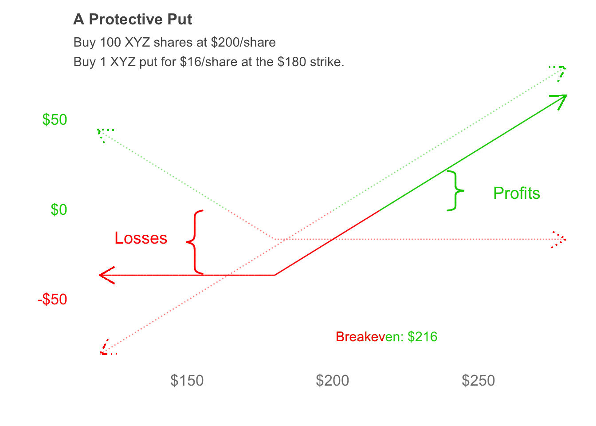
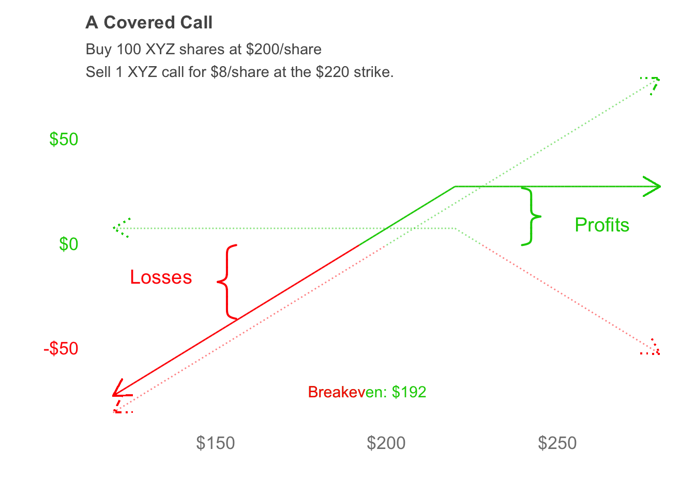
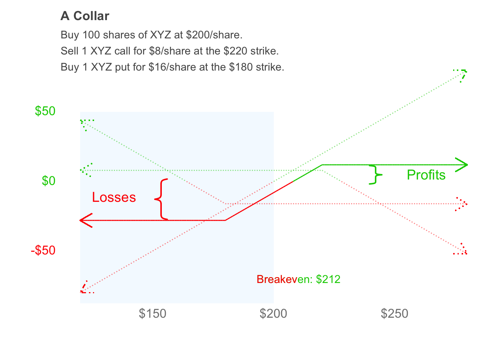
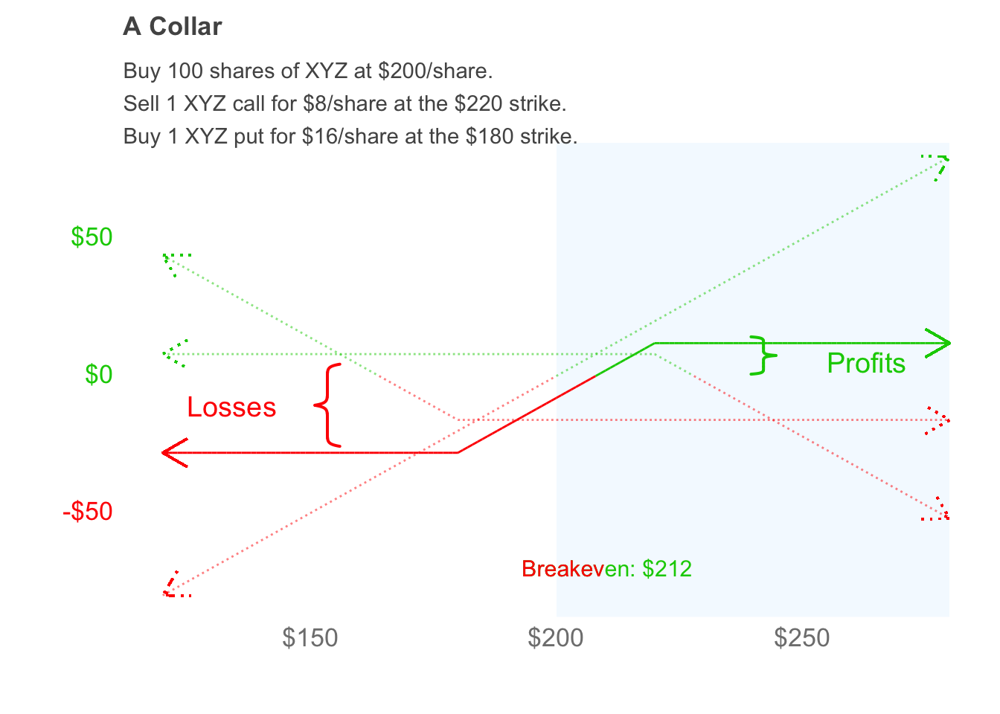
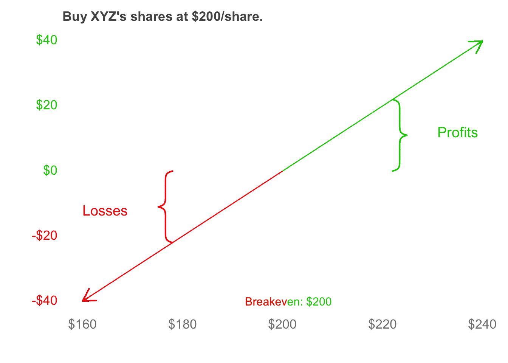
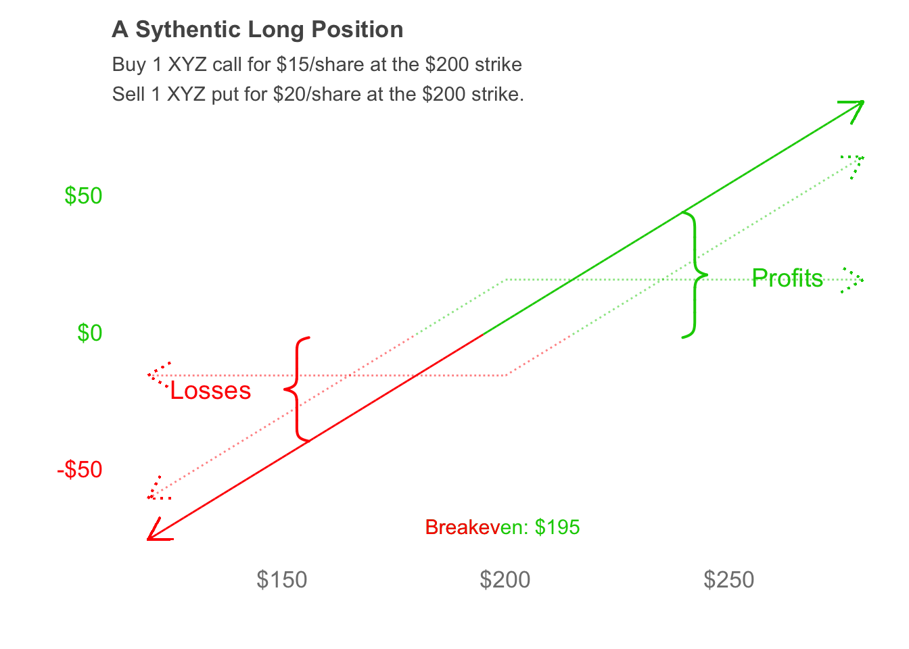
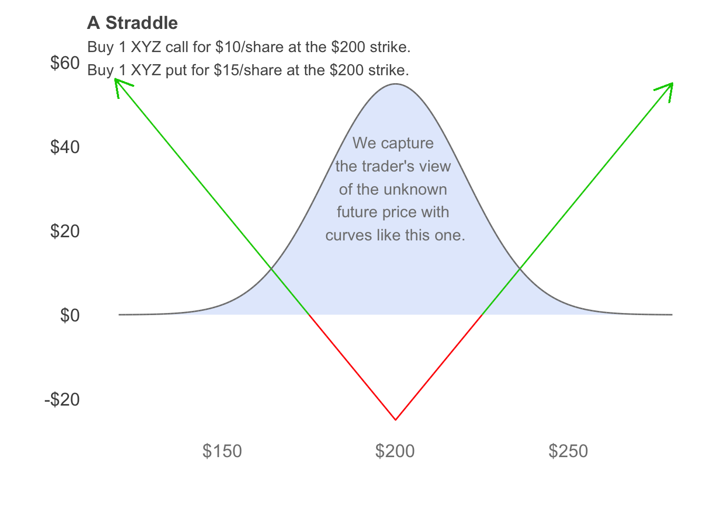
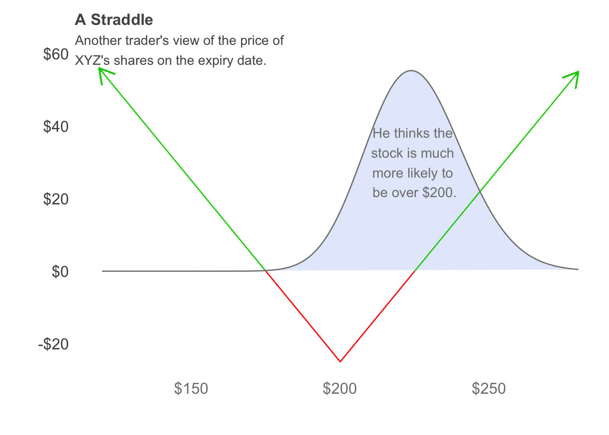
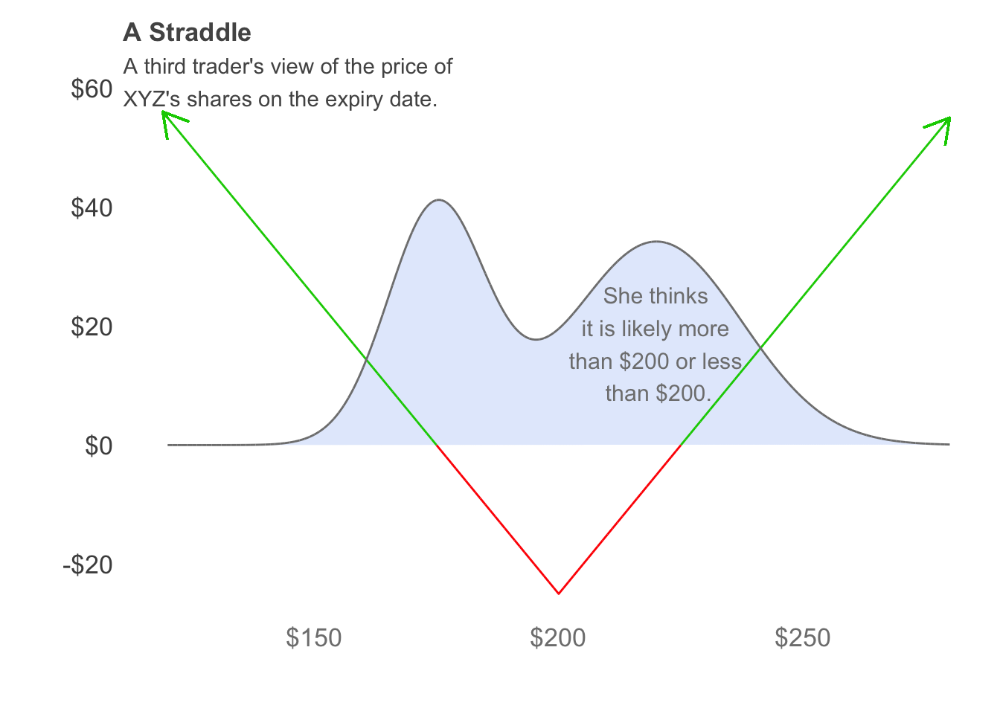

<!-- Each chapter is set to compile separately - include "global" set-up -->

```{r setup, include=FALSE}
knitr::opts_chunk$set(echo = FALSE)

CRAN_repo = getOption("repos")
CRAN_repo["CRAN"] = "http://cran.us.r-project.org"
options(repos = CRAN_repo)

if ( !require("here") )          { install.packages("here") };            require(here)
if ( !require("tidyverse") )     { install.packages("tidyverse") };       require(tidyverse)
if ( !require("ggtext") )        { install.packages("ggtext") };          require(ggtext)
if ( !require("pBrackets") )     { install.packages("pBrackets") };       require(pBrackets)
if ( !require("htmlwidgets") )   { install.packages("htmlwidgets") };     require(htmlwidgets)
if ( !require("plotly") )        { install.packages("plotly") };          require(plotly)
if ( !require("formattable") )   { install.packages("formattable") };     require(formattable)
if ( !require("kableExtra") )    { install.packages("kableExtra") };      require(kableExtra)
if ( !require("rtsdata") )       { install.packages("rtsdata") };         require(rtsdata)
if ( !require("PerformanceAnalytics") )     { install.packages("PerformanceAnalytics") };   require(PerformanceAnalytics)
if ( !require("anytime") )       { install.packages("anytime") };         require(anytime)
if ( !require("nor1mix") )       { install.packages("nor1mix") };         require(nor1mix)

options(kableExtra.html.bsTable = TRUE)
options(kableExtra.auto_format = FALSE)
```

```{r Set-Global-Chapter-Variables}
plot_bg <- "#FFFFFF" # "#191919"
plot_fg <- "#000000" # #929292"
plot_fg_alt <- "#969696" # ??

save_tables_as_pictures <- FALSE
load_table_pictures <- TRUE
out_width_plot <- "80%"
out_width_table <- "90%"

grid::grid.locator(unit="npc") 
output_epub = knitr::opts_knit$get("rmarkdown.pandoc.to") == "epub3"
source("Plotting_Functions.R")
```

```{r Table-Helper-Functions}
at_least_number <- function(x,number) {
  ifelse( typeof(x) == "character", 
          return( as.numeric(gsub('\\(','-',gsub('[)$,]', '', x))) >= number ),
          return( x >= number) )
}

remove_negative_zeros <- function(x) { (x[which(-1e-4 < x & x < 1e-4)] = 0); return(x) }
```

# Building Options Strategies

We can do a lot more with options than just buying or selling one put or one call. Stocks, calls, and puts are our basic building blocks. We can buy and sell these building blocks in any combination to construct an investment with the payoff diagram that we want. There are a lot of option strategies and they all have their different names. You might think that you have to memorize everything about them to know how these strategies work, but they all come from combining these basic building blocks. Don't get me wrong -- it helps to know the names of these strategies, and I'll be using them in this book.
But you don't *need* to know their names to understand the strengths and weaknesses of a strategy. The goal of this chapter is to give you the tools you need to construct options strategies on-the-fly that have the exact payoff diagram that you want. 

## Protective Put

A protective put combines owning shares of a stock with buying puts on the same stock. The goal of this strategy is protect the stock position against large losses. 

```{r XYZ-Protective-Put, fig.align = "center", out.width = out_width_plot, message = FALSE}
Put_cost <- 16; Put_K <- 180
Stock_cost <- 200
x_min <- 120; x_max = 280

Stock_Payoff_XYZ <- tibble( "stock_price_x" = seq(from = x_min, to = x_max, by = 0.01),
                            "stock_profit_y" = -Stock_cost + seq(from = x_min, to = x_max, by = 0.01),
                            "Profitable" = ifelse(-Stock_cost + seq(from = x_min, to = x_max, by = 0.01) > 0, 
                                                  "Profit_stock","Loss_stock") )

Put_Payoff_XYZ_180 <- tibble( "Put_x" = seq(from = x_min, to = x_max, by = 0.01),
                              "Put_y" = -Put_cost - (Put_x < Put_K) * (Put_x - Put_K),
                              "Profitable" = ifelse(-Put_cost - (Put_x < Put_K) * (Put_x - Put_K) >= 0,
                                                    "Profit_put", "Loss_put") )

Protective_Put_Payoff_XYZ <- tibble( "Protective_Put_x" = seq(from = x_min, to = x_max, by = 0.01),
                            "Protective_Put_y" = -Put_cost - (Protective_Put_x < Put_K) * (Protective_Put_x - Put_K) + 
                                                  seq(from = x_min, to = x_max, by = 0.01) - Stock_cost,
                            "Profitable" = ifelse( ( -Put_cost - (Protective_Put_x < Put_K) * (Protective_Put_x - Put_K) + 
                                                  seq(from = x_min, to = x_max, by = 0.01) - Stock_cost) > 0, 
                                                  "Profit_protective_put","Loss_protective_put") )


sl1 <- bracketsGrob(0.25, 0.30, 0.25, 0.50, lwd=2, col="red")
sl2 <- bracketsGrob(0.725, 0.625, 0.725, 0.50, lwd=2, col="green3")

temp <- protective_put_payoff(data_protective_put = Protective_Put_Payoff_XYZ,
                              data_stock = Stock_Payoff_XYZ, data_put = Put_Payoff_XYZ_180,
                              main_title = "A Protective Put",
                              sub_title = "Buy 100 XYZ shares at $200/share\nBuy 1 XYZ put for $16/share at the $180 strike.")
y_axis_labels <- na.omit( ggplot_build(temp)$layout$panel_params[[1]]$y$get_labels() )
y_axis_labels <- as.numeric(gsub('\\(','-',gsub('[)$,]', '', y_axis_labels)))
tick_color <- ifelse( as.numeric(gsub('\\(','-',gsub('[)$,]', '', y_axis_labels))) < 0,
                      "red", "green3" )

temp <- temp + theme( axis.text.y = element_markdown(colour = tick_color) ) +
     annotate( geom = "text", x = 125, y = -15, color = "red", hjust = 0,
               label = paste0("Losses"), size = 5 ) +
     annotate( geom = "text", x = 255, y = 10, color = "green3", hjust = 0,
               label = paste0("Profits"), size = 5 ) +
     annotate( geom = "text", x = Put_cost + Stock_cost - 15, 
               y = min(y_axis_labels)-20, color = "green3", hjust = 0,
               label = paste0("Breakeven: ", scales::dollar(Put_cost + Stock_cost)), size = 4 ) +
     annotate( geom = "text", x = Put_cost + Stock_cost - 15, 
               y = min(y_axis_labels)-20, color = "red", hjust = 0,
               label = "Breakev", size = 4 ) +
     annotation_custom( sl1 ) + annotation_custom( sl2 )

if ( !output_epub ) { print(temp); rm(temp) }
if ( output_epub ) {  }
```

## Covered Call

A covered call combines owning shares of a stock with selling calls on the same stock. The goal of this strategy is *yield enhancement*: repeatedly selling (monthly) calls against a stock we already own gives us extra cash every month. We'll talk more about options strategies, including covered calls and protective puts, in a later chapter. For now, let's put the covered call together by buying 100 shares of XYZ and selling 1 call. 

```{r XYZ-Covered-Call, fig.align = "center", out.width = out_width_plot, message = FALSE}
Call_cost <- 8; Call_K <- 220
Stock_cost <- 200
x_min <- 120; x_max = 280

Stock_Payoff_XYZ <- tibble( "stock_price_x" = seq(from = x_min, to = x_max, by = 0.01),
                            "stock_profit_y" = -Stock_cost + seq(from = x_min, to = x_max, by = 0.01),
                            "Profitable" = ifelse(-Stock_cost + seq(from = x_min, to = x_max, by = 0.01) > 0, 
                                                  "Profit_stock","Loss_stock") )

Call_Payoff_XYZ_220 <- tibble( "Call_x" = seq(from = x_min, to = x_max, by = 0.01),
                               "Call_y" = -( -Call_cost + (Call_x > Call_K)*(Call_x-Call_K) ),
                               "Profitable" = ifelse(-Call_cost + (Call_x > Call_K)*(Call_x-Call_K) <= 0,
                                                    "Profit_call", "Loss_call") )

Covered_Call_Payoff_XYZ <- tibble( "Covered_Call_x" = seq(from = x_min, to = x_max, by = 0.01),
                            "Covered_Call_y" = -(-Call_cost + (Covered_Call_x > Call_K)*(Covered_Call_x-Call_K)) + 
                                                  seq(from = x_min, to = x_max, by = 0.01) - Stock_cost,
                            "Profitable" = ifelse( -( -Call_cost + (Covered_Call_x > Call_K)*(Covered_Call_x-Call_K) ) + 
                                                  seq(from = x_min, to = x_max, by = 0.01) - Stock_cost > 0, 
                                                  "Profit_covered_call","Loss_covered_call") )


sl1 <- bracketsGrob(0.25, 0.30, 0.25, 0.50, lwd=2, col="red")
sl2 <- bracketsGrob(0.725, 0.655, 0.725, 0.50, lwd=2, col="green3")

temp <- covered_call_payoff(data_covered_call = Covered_Call_Payoff_XYZ,
                            data_stock = Stock_Payoff_XYZ, data_call = Call_Payoff_XYZ_220,
                            main_title = "A Covered Call",
                            sub_title = "Buy 100 XYZ shares at $200/share\nSell 1 XYZ call for $8/share at the $220 strike.")
y_axis_labels <- na.omit( ggplot_build(temp)$layout$panel_params[[1]]$y$get_labels() )
y_axis_labels <- as.numeric(gsub('\\(','-',gsub('[)$,]', '', y_axis_labels)))
tick_color <- ifelse( as.numeric(gsub('\\(','-',gsub('[)$,]', '', y_axis_labels))) < 0,
                      "red", "green3" )

temp <- temp + theme( axis.text.y = element_markdown(colour = tick_color) ) +
     annotate( geom = "text", x = 125, y = -15, color = "red", hjust = 0,
               label = paste0("Losses"), size = 5 ) +
     annotate( geom = "text", x = 255, y = 10, color = "green3", hjust = 0,
               label = paste0("Profits"), size = 5 ) +
     annotate( geom = "text", x = Stock_cost - Call_cost - 15,
               y = min(y_axis_labels)-20, color = "green3", hjust = 0,
               label = paste0("Breakeven: ", scales::dollar(Stock_cost - Call_cost)), size = 4 ) +
     annotate( geom = "text", x = Stock_cost - Call_cost - 15,
               y = min(y_axis_labels)-20, color = "red", hjust = 0,
               label = "Breakev", size = 4 ) +
     annotation_custom( sl1 ) + annotation_custom( sl2 )

if ( !output_epub ) { print(temp); rm(temp) }
if ( output_epub ) {  }
```

## A Collar 

In the covered call, we bought 100 shares and sold 1 call. In the protective put, we bought 100 shares and bought 1 put. In the collar, we *combine* these two strategies: we buy 100 shares, buy 1 put, and sell 1 call. The idea here is that we want the protection offered by the put, but we want to offset the cost of the put so we sell a call too. 

```{r XYZ-Collar-Left, fig.align = "center", out.width = out_width_plot, message = FALSE}
Put_cost <- 16; Put_K <- 180
Call_cost <- 8; Call_K <- 220
Stock_cost <- 200
x_min <- 120; x_max = 280


Stock_Payoff_XYZ <- tibble( "Stock_x" = seq(from = x_min, to = x_max, by = 0.01),
                            "Stock_y" = -Stock_cost + seq(from = x_min, to = x_max, by = 0.01),
                            "Profitable" = ifelse(-Stock_cost + seq(from = x_min, to = x_max, by = 0.01) > 0, 
                                                  "Profit_stock","Loss_stock") )

Call_Payoff_XYZ_220 <- tibble( "Call_x" = seq(from = x_min, to = x_max, by = 0.01),
                               "Call_y" = -( -Call_cost + (Call_x > Call_K)*(Call_x-Call_K) ),
                               "Profitable" = ifelse(-Call_cost + (Call_x > Call_K)*(Call_x-Call_K) < 0, 
                                                      "Profit_call","Loss_call") )

Put_Payoff_XYZ_180 <- tibble( "Put_x" = seq(from = x_min, to = x_max, by = 0.01),
                              "Put_y" = -Put_cost - (Put_x < Put_K) * (Put_x - Put_K),
                              "Profitable" = ifelse(-Put_cost - (Put_x < Put_K) * (Put_x - Put_K) > 0,
                                                    "Profit_put", "Loss_put") )

Collar_Payoff_XYZ <- tibble( "Collar_x" = seq(from = x_min, to = x_max, by = 0.01),
                            "Collar_y" = -(-Call_cost + (Collar_x > Call_K)*(Collar_x-Call_K) ) 
                            + ( -Put_cost - (Collar_x < Put_K) * (Collar_x - Put_K) ) + Collar_x - Stock_cost,
                            "Profitable" = ifelse( Collar_y > 0, "Profit_collar","Loss_collar") ) 

fill_color_left <- data.frame(xstart = 120, xend = 200, col = "aliceblue")
fill_color_right <- data.frame(xstart = 200, xend = 280, col = "aliceblue")


sl1 <- bracketsGrob(0.25, 0.345, 0.25, 0.51, lwd=2, col="red")
sl2 <- bracketsGrob(0.725, 0.565, 0.725, 0.49, lwd=2, col="green3")

temp <- collar_payoff_left(data_collar = Collar_Payoff_XYZ, data_stock = Stock_Payoff_XYZ,
                      data_call = Call_Payoff_XYZ_220, data_put = Put_Payoff_XYZ_180,
                      main_title = "A Collar", 
                      sub_title = "Buy 100 shares of XYZ at $200/share.\nSell 1 XYZ call for $8/share at the $220 strike.\nBuy 1 XYZ put for $16/share at the $180 strike.")
y_axis_labels <- na.omit( ggplot_build(temp)$layout$panel_params[[1]]$y$get_labels() )
y_axis_labels <- as.numeric(gsub('\\(','-',gsub('[)$,]', '', y_axis_labels)))
tick_color <- ifelse( as.numeric(gsub('\\(','-',gsub('[)$,]', '', y_axis_labels))) < 0,
                      "red", "green3" )

temp <- temp + theme( axis.text.y = element_markdown(colour = tick_color) ) +
     annotate( geom = "text", x = 125, y = -11, color = "red", hjust = 0,
               label = paste0("Losses"), size = 5 ) +
     annotate( geom = "text", x = 255, y = 5, color = "green3", hjust = 0,
               label = paste0("Profits"), size = 5 ) +
     annotate( geom = "text", x = Call_K+Call_cost-35, y = min(y_axis_labels)-20, color = "green3", hjust = 0,
               label = paste0("Breakeven: ", scales::dollar(Call_K+Call_cost-Put_cost)), size = 4 ) +
     annotate( geom = "text", x = Call_K+Call_cost-35, y = min(y_axis_labels)-20, color = "red", hjust = 0,
               label = "Breakev", size = 4 ) +
     annotation_custom( sl1 ) + annotation_custom( sl2 )

if ( !output_epub ) { print(temp); rm(temp) }
if ( output_epub ) {  }
```

```{r XYZ-Collar-Right, fig.align = "center", out.width = out_width_plot, message = FALSE}
Put_cost <- 16; Put_K <- 180
Call_cost <- 8; Call_K <- 220
Stock_cost <- 200
x_min <- 120; x_max = 280


Stock_Payoff_XYZ <- tibble( "Stock_x" = seq(from = x_min, to = x_max, by = 0.01),
                            "Stock_y" = -Stock_cost + seq(from = x_min, to = x_max, by = 0.01),
                            "Profitable" = ifelse(-Stock_cost + seq(from = x_min, to = x_max, by = 0.01) > 0, 
                                                  "Profit_stock","Loss_stock") )

Call_Payoff_XYZ_220 <- tibble( "Call_x" = seq(from = x_min, to = x_max, by = 0.01),
                               "Call_y" = -( -Call_cost + (Call_x > Call_K)*(Call_x-Call_K) ),
                               "Profitable" = ifelse(-Call_cost + (Call_x > Call_K)*(Call_x-Call_K) < 0, 
                                                      "Profit_call","Loss_call") )

Put_Payoff_XYZ_180 <- tibble( "Put_x" = seq(from = x_min, to = x_max, by = 0.01),
                              "Put_y" = -Put_cost - (Put_x < Put_K) * (Put_x - Put_K),
                              "Profitable" = ifelse(-Put_cost - (Put_x < Put_K) * (Put_x - Put_K) > 0,
                                                    "Profit_put", "Loss_put") )

Collar_Payoff_XYZ <- tibble( "Collar_x" = seq(from = x_min, to = x_max, by = 0.01),
                            "Collar_y" = -(-Call_cost + (Collar_x > Call_K)*(Collar_x-Call_K) ) 
                            + ( -Put_cost - (Collar_x < Put_K) * (Collar_x - Put_K) ) + Collar_x - Stock_cost,
                            "Profitable" = ifelse( Collar_y > 0, "Profit_collar","Loss_collar") ) 

fill_color_left <- data.frame(xstart = 120, xend = 200, col = "aliceblue")
fill_color_right <- data.frame(xstart = 200, xend = 280, col = "aliceblue")


sl1 <- bracketsGrob(0.25, 0.345, 0.25, 0.51, lwd=2, col="red")
sl2 <- bracketsGrob(0.725, 0.565, 0.725, 0.49, lwd=2, col="green3")

temp <- collar_payoff_right(data_collar = Collar_Payoff_XYZ, data_stock = Stock_Payoff_XYZ,
                      data_call = Call_Payoff_XYZ_220, data_put = Put_Payoff_XYZ_180,
                      main_title = "A Collar", 
                      sub_title = "Buy 100 shares of XYZ at $200/share.\nSell 1 XYZ call for $8/share at the $220 strike.\nBuy 1 XYZ put for $16/share at the $180 strike.")
y_axis_labels <- na.omit( ggplot_build(temp)$layout$panel_params[[1]]$y$get_labels() )
y_axis_labels <- as.numeric(gsub('\\(','-',gsub('[)$,]', '', y_axis_labels)))
tick_color <- ifelse( as.numeric(gsub('\\(','-',gsub('[)$,]', '', y_axis_labels))) < 0,
                      "red", "green3" )

temp <- temp + theme( axis.text.y = element_markdown(colour = tick_color) ) +
     annotate( geom = "text", x = 125, y = -11, color = "red", hjust = 0,
               label = paste0("Losses"), size = 5 ) +
     annotate( geom = "text", x = 255, y = 5, color = "green3", hjust = 0,
               label = paste0("Profits"), size = 5 ) +
     annotate( geom = "text", x = Call_K+Call_cost-35, y = min(y_axis_labels)-20, color = "green3", hjust = 0,
               label = paste0("Breakeven: ", scales::dollar(Call_K+Call_cost-Put_cost)), size = 4 ) +
     annotate( geom = "text", x = Call_K+Call_cost-35, y = min(y_axis_labels)-20, color = "red", hjust = 0,
               label = "Breakev", size = 4 ) +
     annotation_custom( sl1 ) + annotation_custom( sl2 )

if ( !output_epub ) { print(temp); rm(temp) }
if ( output_epub ) {  }
```


## Sythentic Long Stock

Say we want to replicate the payoff diagram of owning Company XYZ's using calls and puts. 

```{r XYZ-Stock-Demo, fig.align = "center", out.width = out_width_plot, message = FALSE}
Stock_cost <- 200
x_min = 160; x_max = 240

Stock_Payoff_XYZ <- tibble( "stock_price_x" = seq(from = x_min, to = x_max, by = 0.01),
                            "stock_profit_y" = -Stock_cost + seq(from = x_min, to = x_max, by = 0.01),
                            "Profitable" = ifelse(-Stock_cost + seq(from = x_min, to = x_max, by = 0.01) > 0, 
                                                  "Profit","Loss") )

s1 <- bracketsGrob(0.25, 0.25, 0.25, 0.5, lwd=2, col="red")
s2 <- bracketsGrob(0.75, 0.75, 0.75, 0.5, lwd=2, col="green3")

### Source: https://stackoverflow.com/questions/35633239/add-curly-braces-to-ggplot2-and-then-use-ggsave
temp <- stock_payoff(Stock_Payoff_XYZ, main = "Buy XYZ's shares at $200/share.")
y_axis_labels <- na.omit( ggplot_build(temp)$layout$panel_params[[1]]$y$get_labels() )
y_axis_labels <- as.numeric(gsub('\\(','-',gsub('[)$,]', '', y_axis_labels)))
tick_color <- ifelse( y_axis_labels < 0, "red", "green3" )

temp <- temp + theme( axis.text.y = element_markdown(colour = tick_color) ) + 
     annotate( geom = "text", x = 160, y = -12, color = "red", hjust = 0, 
               label = paste0("Losses"), size = 5 ) + 
     annotate( geom = "text", x = 231, y = 12, color = "green3", hjust = 0, 
               label = paste0("Profits"), size = 5 ) + 
     annotate( geom = "text", x = Stock_cost-7.5, y = min(y_axis_labels), color = "green3", hjust = 0,
               label = paste0("Breakeven: ", scales::dollar(Stock_cost)), size = 4 ) + 
     annotate( geom = "text", x = Stock_cost-7.5, y = min(y_axis_labels), color = "red", hjust = 0,
               label = "Breakev", size = 4 ) +
     annotation_custom( s1 ) + annotation_custom( s2 ) 

if ( !output_epub ) { print(temp); rm(temp) }
if ( output_epub ) {  }
```

This is the payoff diagram for owning Company XYZ's stock that we saw in Chapter 2. I want the *same* payoff diagram using calls and puts. The key is to remember that a call makes money when the stock goes up, and a put makes money when the stock goes down. The easiest way to do this is to look at the different *parts* of the payoff diagram. This one has two parts, on one each side of the breakeven price of \$200. To the right of the breakeven, we *make* money when the stock goes up. That sounds like a call, so I'm going to buy a \$200 strike call to replicate the green part of the payoff diagram. To the left of \$200, we lose money as the stock goes down. If I buy a put, I make money as the stock goes down, but I want the opposite of that. So I'm going to sell a \$200 strike put to replicate the red part of payoff diagram. 

My first attempt at replicating the payoff diagram of owning one share of Company XYZ is to buy a \$200 strike call for \$15 (per share) and sell a \$200 strike put for \$20 (per share), where the call and the put have the same expiry date.  

```{r XYZ-Synthetic-Long, fig.align = "center", out.width = out_width_plot, message = FALSE}
Call_cost <- 15; Put_cost <- 20
Call_K <- 200; Put_K <- 200
Stock_cost <- 200
x_min <- 120; x_max = 280

Stock_Payoff_XYZ <- tibble( "stock_price_x" = seq(from = x_min, to = x_max, by = 0.01),
                            "stock_profit_y" = -Stock_cost + seq(from = x_min, to = x_max, by = 0.01),
                            "Profitable" = ifelse(-Stock_cost + seq(from = x_min, to = x_max, by = 0.01) > 0, 
                                                  "Profit_stock","Loss_stock") )

Call_Payoff_XYZ_200 <- tibble( "Call_x" = seq(from = x_min, to = x_max, by = 0.01),
                               "Call_y" = -Call_cost + (Call_x > Call_K)*(Call_x-Call_K),
                               "Profitable" = ifelse(-Call_cost + (Call_x > Call_K)*(Call_x-Call_K) > 0, 
                                                      "Profit_call","Loss_call") )

Put_Payoff_XYZ_200 <- tibble( "Put_x" = seq(from = x_min, to = x_max, by = 0.01),
                              "Put_y" = -( -Put_cost - (Put_x < Put_K) * (Put_x - Put_K) ),
                              "Profitable" = ifelse(-Put_cost - (Put_x < Put_K) * (Put_x - Put_K) < 0,
                                                    "Profit_put", "Loss_put") )

Sythetic_Long_Payoff_XYZ <- tibble( "Synthetic_Long_x" = seq(from = x_min, to = x_max, by = 0.01),
                            "Synthetic_Long_y" = ( -Call_cost + (Synthetic_Long_x > Call_K)*(Synthetic_Long_x-Call_K) ) 
                            - ( -Put_cost - (Synthetic_Long_x < Put_K) * (Synthetic_Long_x - Put_K) ),
                            "Profitable" = ifelse( ( -Call_cost + (Synthetic_Long_x > Call_K)*(Synthetic_Long_x-Call_K) ) 
                            - ( -Put_cost - (Synthetic_Long_x < Put_K) * (Synthetic_Long_x - Put_K) ) > 0, 
                                                  "Profit_stock","Loss_stock") )


sl1 <- bracketsGrob(0.25, 0.25, 0.25, 0.465, lwd=2, col="red")
sl2 <- bracketsGrob(0.725, 0.725, 0.725, 0.465, lwd=2, col="green3")

temp <- synthetic_long_payoff(data_synthetic_long = Sythetic_Long_Payoff_XYZ,
                    data_call = Call_Payoff_XYZ_200, data_put = Put_Payoff_XYZ_200,
                    main_title = "A Sythentic Long Position",
                    sub_title = "Buy 1 XYZ call for $15/share at the $200 strike\nSell 1 XYZ put for $20/share at the $200 strike.")
y_axis_labels <- na.omit( ggplot_build(temp)$layout$panel_params[[1]]$y$get_labels() )
y_axis_labels <- as.numeric(gsub('\\(','-',gsub('[)$,]', '', y_axis_labels)))
tick_color <- ifelse( as.numeric(gsub('\\(','-',gsub('[)$,]', '', y_axis_labels))) < 0,
                      "red", "green3" )

temp <- temp + theme( axis.text.y = element_markdown(colour = tick_color) ) + 
     annotate( geom = "text", x = 125, y = -20, color = "red", hjust = 0, 
               label = paste0("Losses"), size = 5 ) + 
     annotate( geom = "text", x = 255, y = 21, color = "green3", hjust = 0, 
               label = paste0("Profits"), size = 5 ) + 
     annotate( geom = "text", x = Call_K+Call_cost-33, y = min(y_axis_labels)-20, color = "green3", hjust = 0,
               label = paste0("Breakeven: ", scales::dollar(Call_K+Call_cost-Put_cost)), size = 4 ) + 
     annotate( geom = "text", x = Call_K+Call_cost-33, y = min(y_axis_labels)-20, color = "red", hjust = 0,
               label = "Breakev", size = 4 ) +  
     annotation_custom( sl1 ) + annotation_custom( sl2 ) 

if ( !output_epub ) { print(temp); rm(temp) }
if ( output_epub ) {  }
```
In this picture, the \$200 strike *long call* and \$200 strike *short put* are the two dashed lines, and the replicated *long stock* position is the solid line. Putting "long" or "short" before a position is just a shorthand way of saying if we bought it (are "long" it) or sold it (are "short" it). We bought the \$200 strike call, so it is a *long call*. We sold the \$200 strike put, so it is a *short put*. We are replicating the payoff of owning a stock, so it is a *long stock* position. This is a very useful shorthand, and one that I'll be using throughout the rest of the book.

How do we get the solid line from the two dashed lines? The \$200 strike call starts off flat and 

It might take a minute or two of staring at the plot, but you should be able to convince yourself of this

Jumping back into the picture, the breakeven is \$195. That's because we bought a \$200 strike call for \$15, and sold a \$200 strike for \$20. Let's ignore the cost of the two options for a moment, and suppose that XYZ's shares are exactly at \$200 on the expiry date. The 


## The Straddle

```{r XYZ-Straddle, fig.align = "center", out.width = out_width_plot, message = FALSE}
Call_cost <- 10; Put_cost <- 15
Call_K <- 200; Put_K <- 200
x_min <- 120; x_max = 280
Stock_cost <- 200

Breakeven_right <- Put_K - Put_cost - Call_cost
Breakeven_left <- Call_K + Call_cost + Put_cost

Call_Payoff_XYZ <- tibble( "Call_x" = seq(from = x_min, to = x_max, by = 0.01),
                            "Call_y" = -Call_cost + (Call_x > Call_K)*(Call_x-Call_K),
                            "Profitable" = ifelse(-Call_cost + (Call_x > Call_K)*(Call_x-Call_K) > 0, 
                                                      "Profit_call","Loss_call") )

Put_Payoff_XYZ <- tibble( "Put_x" = seq(from = x_min, to = x_max, by = 0.01),
                          "Put_y" = -Put_cost - (Put_x < Put_K) * (Put_x - Put_K),
                          "Profitable" = ifelse(-Put_cost - (Put_x < Put_K) * (Put_x - Put_K) >= 0,
                                                "Profit_put", "Loss_put") )

Straddle_Payoff_XYZ_left <- tibble( "Straddle_x" = seq(from = x_min, to = Breakeven_right, by = 0.01),
                                     "Straddle_y" = -Put_cost - (Straddle_x < Put_K) * (Straddle_x - Put_K) 
                                     - Call_cost + (Straddle_x > Call_K)*(Straddle_x-Call_K),
                                     "Profitable" = ifelse( -Put_cost - (Straddle_x < Put_K) * (Straddle_x - Put_K) 
                                                            - Call_cost + (Straddle_x > Call_K)*(Straddle_x-Call_K) > 0, 
                                                            "Profit_right_straddle","Loss_right_straddle") )  

Straddle_Payoff_XYZ_center <- tibble( "Straddle_x" = seq(from = Breakeven_right, to = Breakeven_left, by = 0.01),
                                      "Straddle_y" = -Put_cost - (Straddle_x < Put_K) * (Straddle_x - Put_K) 
                                      - Call_cost + (Straddle_x > Call_K)*(Straddle_x-Call_K),
                                      "Profitable" = ifelse( -Put_cost - (Straddle_x < Put_K) * (Straddle_x - Put_K) 
                                                             - Call_cost + (Straddle_x > Call_K)*(Straddle_x-Call_K) > 0, 
                                                            "Profit_center_straddle","Loss_center_straddle") )  

Straddle_Payoff_XYZ_right <- tibble( "Straddle_x" = seq(from = Breakeven_left, to = x_max, by = 0.01),
                                    "Straddle_y" = -Put_cost - (Straddle_x < Put_K) * (Straddle_x - Put_K) 
                                    - Call_cost + (Straddle_x > Call_K)*(Straddle_x-Call_K),
                                    "Profitable" = ifelse( -Put_cost - (Straddle_x < Put_K) * (Straddle_x - Put_K) 
                                                           - Call_cost + (Straddle_x > Call_K)*(Straddle_x-Call_K) > 0, 
                                                           "Profit_right_straddle","Loss_right_straddle") )  

temp <- straddle_payoff( data_straddle_left = Straddle_Payoff_XYZ_left,
                         data_straddle_center = Straddle_Payoff_XYZ_center,
                         data_straddle_right = Straddle_Payoff_XYZ_right,
                         data_call = Call_Payoff_XYZ, 
                         data_put = Put_Payoff_XYZ,
                         main_title = "A Straddle",
                         sub_title = "Buy 1 XYZ call for $10/share at the $200 strike.\nBuy 1 XYZ put for $15/share at the $200 strike.")
y_axis_labels <- na.omit( ggplot_build(temp)$layout$panel_params[[1]]$y$get_labels() )
y_axis_labels <- as.numeric(gsub('\\(','-',gsub('[)$,]', '', y_axis_labels)))
tick_color <- ifelse( as.numeric(gsub('\\(','-',gsub('[)$,]', '', y_axis_labels))) < 0,
                      "red", "green3" )

if ( !output_epub ) { print(temp); rm(temp) }
if ( output_epub ) { knitr::include_graphics("03-combining-payoffs_files/figure-html/XYZ-Straddle-1.png") }
```

```{r XYZ-Straddle-Normal, fig.align = "center", out.width = out_width_plot, message = FALSE}
Call_cost <- 10; Put_cost <- 15
Call_K <- 200; Put_K <- 200
x_min <- 120; x_max = 280
Stock_cost <- 200

Breakeven_right <- Put_K - Put_cost - Call_cost
Breakeven_left <- Call_K + Call_cost + Put_cost

Call_Payoff_XYZ <- tibble( "Call_x" = seq(from = x_min, to = x_max, by = 0.01),
                            "Call_y" = -Call_cost + (Call_x > Call_K)*(Call_x-Call_K),
                            "Profitable" = ifelse(-Call_cost + (Call_x > Call_K)*(Call_x-Call_K) > 0, 
                                                      "Profit_call","Loss_call") )

Put_Payoff_XYZ <- tibble( "Put_x" = seq(from = x_min, to = x_max, by = 0.01),
                          "Put_y" = -Put_cost - (Put_x < Put_K) * (Put_x - Put_K),
                          "Profitable" = ifelse(-Put_cost - (Put_x < Put_K) * (Put_x - Put_K) >= 0,
                                                "Profit_put", "Loss_put") )

Straddle_Payoff_XYZ_left <- tibble( "Straddle_x" = seq(from = x_min, to = Breakeven_right, by = 0.01),
                                     "Straddle_y" = -Put_cost - (Straddle_x < Put_K) * (Straddle_x - Put_K) 
                                     - Call_cost + (Straddle_x > Call_K)*(Straddle_x-Call_K),
                                     "Profitable" = ifelse( -Put_cost - (Straddle_x < Put_K) * (Straddle_x - Put_K) 
                                                            - Call_cost + (Straddle_x > Call_K)*(Straddle_x-Call_K) > 0, 
                                                            "Profit_right_straddle","Loss_right_straddle") )  

Straddle_Payoff_XYZ_center <- tibble( "Straddle_x" = seq(from = Breakeven_right, to = Breakeven_left, by = 0.01),
                                      "Straddle_y" = -Put_cost - (Straddle_x < Put_K) * (Straddle_x - Put_K) 
                                      - Call_cost + (Straddle_x > Call_K)*(Straddle_x-Call_K),
                                      "Profitable" = ifelse( -Put_cost - (Straddle_x < Put_K) * (Straddle_x - Put_K) 
                                                             - Call_cost + (Straddle_x > Call_K)*(Straddle_x-Call_K) > 0, 
                                                            "Profit_center_straddle","Loss_center_straddle") )  

Straddle_Payoff_XYZ_right <- tibble( "Straddle_x" = seq(from = Breakeven_left, to = x_max, by = 0.01),
                                    "Straddle_y" = -Put_cost - (Straddle_x < Put_K) * (Straddle_x - Put_K) 
                                    - Call_cost + (Straddle_x > Call_K)*(Straddle_x-Call_K),
                                    "Profitable" = ifelse( -Put_cost - (Straddle_x < Put_K) * (Straddle_x - Put_K) 
                                                           - Call_cost + (Straddle_x > Call_K)*(Straddle_x-Call_K) > 0, 
                                                           "Profit_right_straddle","Loss_right_straddle") )  

Straddle_Payoff_Normal <- tibble( "Dist_x" = seq(from = x_min, to = x_max, by = 0.01), 
                                  "Dist_y" = 10 * 1000 * (55/200) * dnorm(Dist_x, mean = 200, sd = 20) )


temp <- straddle_payoff_dist_overlay( data_straddle_left = Straddle_Payoff_XYZ_left,
                                      data_straddle_center = Straddle_Payoff_XYZ_center,
                                      data_straddle_right = Straddle_Payoff_XYZ_right,
                                      data_distribution_overlay = Straddle_Payoff_Normal, 
                                      fill_rgb = col2rgb("cornflowerblue"),
                                      main_title = "A Straddle",
                                      sub_title = "Buy 1 XYZ call for $10/share at the $200 strike.\nBuy 1 XYZ put for $15/share at the $200 strike.",
                                      curve_text = "We capture \nthe trader's view \nof the unknown \nfuture price with \ncurves like this one.",
                                      curve_text_x = 200, 
                                      curve_text_y = 30 )
y_axis_labels <- na.omit( ggplot_build(temp)$layout$panel_params[[1]]$y$get_labels() )
y_axis_labels <- as.numeric(gsub('\\(','-',gsub('[)$,]', '', y_axis_labels)))
tick_color <- ifelse( as.numeric(gsub('\\(','-',gsub('[)$,]', '', y_axis_labels))) < 0,
                      "red", "green3" )

if ( !output_epub ) { print(temp); rm(temp) }
if ( output_epub ) {  }
```

```{r XYZ-Straddle-Lognormal-Over-K, fig.align = "center", out.width = out_width_plot, message = FALSE}
Call_cost <- 10; Put_cost <- 15
Call_K <- 200; Put_K <- 200
x_min <- 120; x_max = 280
Stock_cost <- 200

Breakeven_right <- Put_K - Put_cost - Call_cost
Breakeven_left <- Call_K + Call_cost + Put_cost

Call_Payoff_XYZ <- tibble( "Call_x" = seq(from = x_min, to = x_max, by = 0.01),
                            "Call_y" = -Call_cost + (Call_x > Call_K)*(Call_x-Call_K),
                            "Profitable" = ifelse(-Call_cost + (Call_x > Call_K)*(Call_x-Call_K) > 0, 
                                                      "Profit_call","Loss_call") )

Put_Payoff_XYZ <- tibble( "Put_x" = seq(from = x_min, to = x_max, by = 0.01),
                          "Put_y" = -Put_cost - (Put_x < Put_K) * (Put_x - Put_K),
                          "Profitable" = ifelse(-Put_cost - (Put_x < Put_K) * (Put_x - Put_K) >= 0,
                                                "Profit_put", "Loss_put") )

Straddle_Payoff_XYZ_left <- tibble( "Straddle_x" = seq(from = x_min, to = Breakeven_right, by = 0.01),
                                     "Straddle_y" = -Put_cost - (Straddle_x < Put_K) * (Straddle_x - Put_K) 
                                     - Call_cost + (Straddle_x > Call_K)*(Straddle_x-Call_K),
                                     "Profitable" = ifelse( -Put_cost - (Straddle_x < Put_K) * (Straddle_x - Put_K) 
                                                            - Call_cost + (Straddle_x > Call_K)*(Straddle_x-Call_K) > 0, 
                                                            "Profit_right_straddle","Loss_right_straddle") )  

Straddle_Payoff_XYZ_center <- tibble( "Straddle_x" = seq(from = Breakeven_right, to = Breakeven_left, by = 0.01),
                                      "Straddle_y" = -Put_cost - (Straddle_x < Put_K) * (Straddle_x - Put_K) 
                                      - Call_cost + (Straddle_x > Call_K)*(Straddle_x-Call_K),
                                      "Profitable" = ifelse( -Put_cost - (Straddle_x < Put_K) * (Straddle_x - Put_K) 
                                                             - Call_cost + (Straddle_x > Call_K)*(Straddle_x-Call_K) > 0, 
                                                            "Profit_center_straddle","Loss_center_straddle") )  

Straddle_Payoff_XYZ_right <- tibble( "Straddle_x" = seq(from = Breakeven_left, to = x_max, by = 0.01),
                                    "Straddle_y" = -Put_cost - (Straddle_x < Put_K) * (Straddle_x - Put_K) 
                                    - Call_cost + (Straddle_x > Call_K)*(Straddle_x-Call_K),
                                    "Profitable" = ifelse( -Put_cost - (Straddle_x < Put_K) * (Straddle_x - Put_K) 
                                                           - Call_cost + (Straddle_x > Call_K)*(Straddle_x-Call_K) > 0, 
                                                           "Profit_right_straddle","Loss_right_straddle") )  

Straddle_Payoff_Lognormal <- tibble( "Dist_x" = seq(from = x_min, to = x_max, by = 0.01), 
                                     "Dist_y" = 10 * 1000 * (45/200) * dlnorm(Dist_x, meanlog = log(225), sdlog = log(1.075)) )

temp <- straddle_payoff_dist_overlay( data_straddle_left = Straddle_Payoff_XYZ_left,
                                      data_straddle_center = Straddle_Payoff_XYZ_center,
                                      data_straddle_right = Straddle_Payoff_XYZ_right,
                                      data_distribution_overlay = Straddle_Payoff_Lognormal, 
                                      fill_rgb = col2rgb("cornflowerblue"),
                                      main_title = "A Straddle",
                                      sub_title = "Another trader's view of the price of \nXYZ's shares on the expiry date.",
                                      curve_text = "He thinks the \nstock is much \nmore likely to \nbe over $200.",
                                      curve_text_x = 225, 
                                      curve_text_y = 30 )
y_axis_labels <- na.omit( ggplot_build(temp)$layout$panel_params[[1]]$y$get_labels() )
y_axis_labels <- as.numeric(gsub('\\(','-',gsub('[)$,]', '', y_axis_labels)))
tick_color <- ifelse( as.numeric(gsub('\\(','-',gsub('[)$,]', '', y_axis_labels))) < 0,
                      "red", "green3" )

if ( !output_epub ) { print(temp); rm(temp) }
if ( output_epub ) {  }
```


```{r XYZ-Straddle-Multimodal, fig.align = "center", out.width = out_width_plot, message = FALSE}
Call_cost <- 10; Put_cost <- 15
Call_K <- 200; Put_K <- 200
x_min <- 120; x_max = 280
Stock_cost <- 200

Breakeven_right <- Put_K - Put_cost - Call_cost
Breakeven_left <- Call_K + Call_cost + Put_cost

Call_Payoff_XYZ <- tibble( "Call_x" = seq(from = x_min, to = x_max, by = 0.01),
                            "Call_y" = -Call_cost + (Call_x > Call_K)*(Call_x-Call_K),
                            "Profitable" = ifelse(-Call_cost + (Call_x > Call_K)*(Call_x-Call_K) > 0, 
                                                      "Profit_call","Loss_call") )

Put_Payoff_XYZ <- tibble( "Put_x" = seq(from = x_min, to = x_max, by = 0.01),
                          "Put_y" = -Put_cost - (Put_x < Put_K) * (Put_x - Put_K),
                          "Profitable" = ifelse(-Put_cost - (Put_x < Put_K) * (Put_x - Put_K) >= 0,
                                                "Profit_put", "Loss_put") )

Straddle_Payoff_XYZ_left <- tibble( "Straddle_x" = seq(from = x_min, to = Breakeven_right, by = 0.01),
                                     "Straddle_y" = -Put_cost - (Straddle_x < Put_K) * (Straddle_x - Put_K) 
                                     - Call_cost + (Straddle_x > Call_K)*(Straddle_x-Call_K),
                                     "Profitable" = ifelse( -Put_cost - (Straddle_x < Put_K) * (Straddle_x - Put_K) 
                                                            - Call_cost + (Straddle_x > Call_K)*(Straddle_x-Call_K) > 0, 
                                                            "Profit_right_straddle","Loss_right_straddle") )  

Straddle_Payoff_XYZ_center <- tibble( "Straddle_x" = seq(from = Breakeven_right, to = Breakeven_left, by = 0.01),
                                      "Straddle_y" = -Put_cost - (Straddle_x < Put_K) * (Straddle_x - Put_K) 
                                      - Call_cost + (Straddle_x > Call_K)*(Straddle_x-Call_K),
                                      "Profitable" = ifelse( -Put_cost - (Straddle_x < Put_K) * (Straddle_x - Put_K) 
                                                             - Call_cost + (Straddle_x > Call_K)*(Straddle_x-Call_K) > 0, 
                                                            "Profit_center_straddle","Loss_center_straddle") )  

Straddle_Payoff_XYZ_right <- tibble( "Straddle_x" = seq(from = Breakeven_left, to = x_max, by = 0.01),
                                     "Straddle_y" = -Put_cost - (Straddle_x < Put_K) * (Straddle_x - Put_K) 
                                     - Call_cost + (Straddle_x > Call_K)*(Straddle_x-Call_K),
                                     "Profitable" = ifelse( -Put_cost - (Straddle_x < Put_K) * (Straddle_x - Put_K) 
                                                            - Call_cost + (Straddle_x > Call_K)*(Straddle_x-Call_K) > 0, 
                                                            "Profit_right_straddle","Loss_right_straddle") )  

Straddle_Payoff_Multimodal <- tibble( "Dist_x" = seq(from = x_min, to = x_max, by = 0.01), 
                                      "Dist_y" = 2.5 * 1000 * dnorMix( x = Dist_x, 
                                                          obj = norMix(mu = c(175, 220), sigma = c(10,17.5), w = c(0.4,0.6)) ) )

temp <- straddle_payoff_dist_overlay( data_straddle_left = Straddle_Payoff_XYZ_left,
                                      data_straddle_center = Straddle_Payoff_XYZ_center,
                                      data_straddle_right = Straddle_Payoff_XYZ_right,
                                      data_distribution_overlay = Straddle_Payoff_Multimodal, 
                                      fill_rgb = col2rgb("cornflowerblue"),
                                      main_title = "A Straddle",
                                      sub_title = "A third trader's view of the price of \nXYZ's shares on the expiry date.",
                                      curve_text = "She thinks \nit is likely more \nthan $200 or less \nthan $200.",
                                      curve_text_x = 220.5, 
                                      curve_text_y = 17 )
y_axis_labels <- na.omit( ggplot_build(temp)$layout$panel_params[[1]]$y$get_labels() )
y_axis_labels <- as.numeric(gsub('\\(','-',gsub('[)$,]', '', y_axis_labels)))
tick_color <- ifelse( as.numeric(gsub('\\(','-',gsub('[)$,]', '', y_axis_labels))) < 0,
                      "red", "green3" )

if ( !output_epub ) { print(temp); rm(temp) }
if ( output_epub ) {  }
```